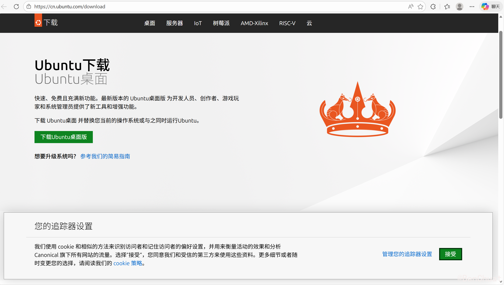
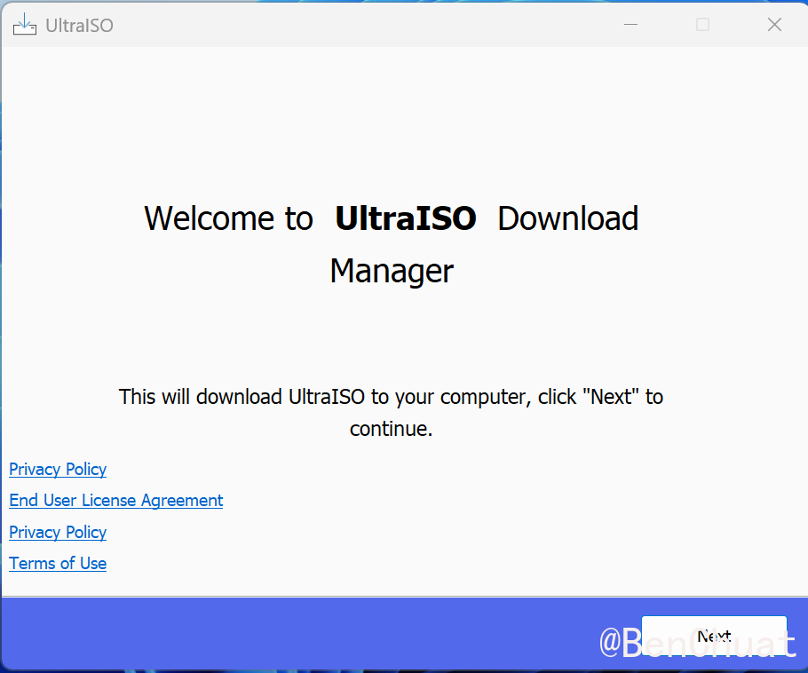
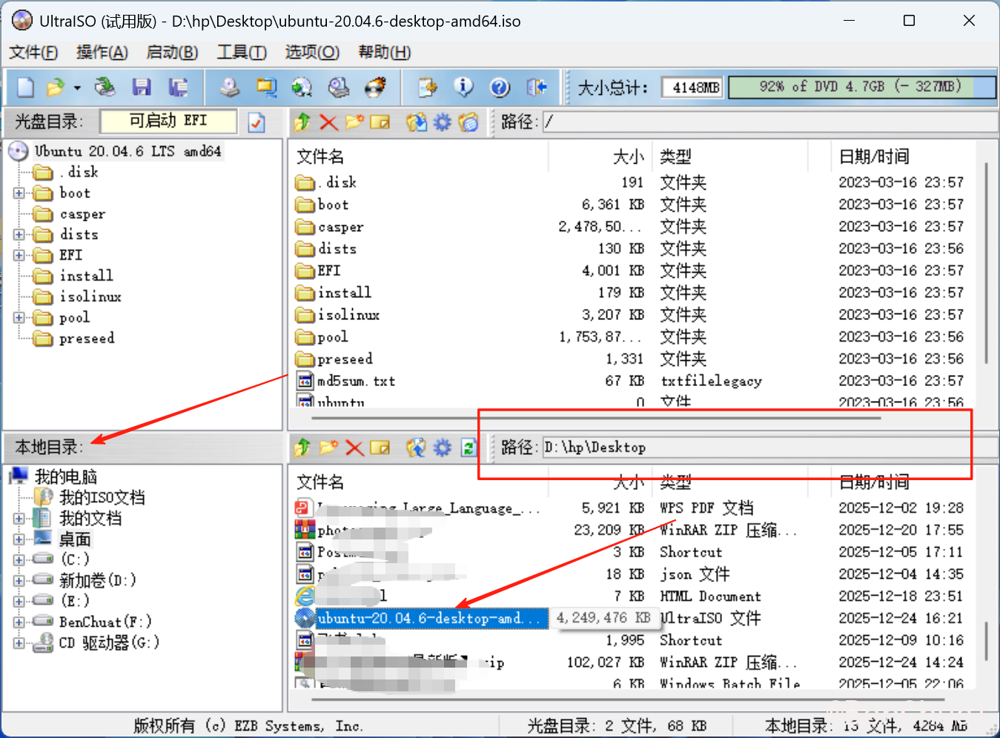
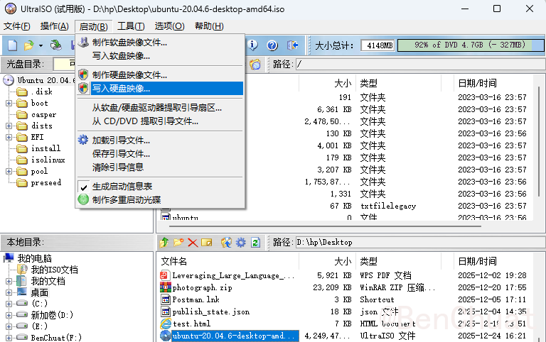
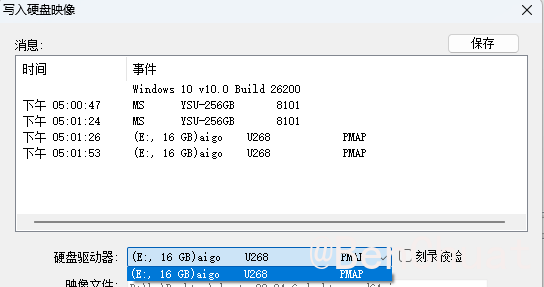
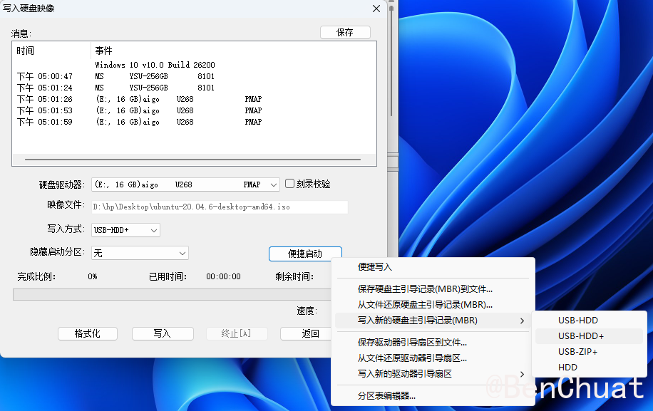
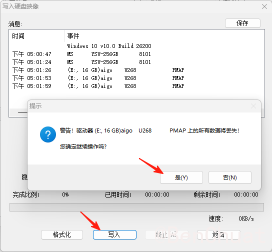
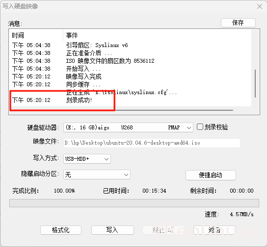

+++
title = "Linux系统安装教程：详细步骤"
date = "2025-12-25T17:06:44.868849+08:00"
lang = "zh-cn"
draft = false
slug = "20251225170644"
categories = []
tags = [ "开发", "Linux",]
featured = false
summary = ""
+++

# Linux系统安装教程：详细步骤

在本文中，我们将详细介绍如何将Linux系统（Ubuntu）安装到计算机中。包括制作启动安装盘、设置BIOS、安装系统以及后期配置。希望这篇博客能帮助你顺利完成系统安装。

## 1. 制作系统镜像启动安装盘

### 1.1 下载Ubuntu系统镜像

首先，你需要从Ubuntu官网下载系统镜像。Ubuntu支持多种版本，选择你需要的版本（如Ubuntu Desktop或Ubuntu Server）。你可以访问以下链接进行下载：

- **Ubuntu官网**：https://cn.ubuntu.com/download

下载完毕后，保存在你的电脑上，记住文件路径。

### 1.2 下载制作启动盘软件（UltraISO）

制作启动盘需要一款合适的工具，这里我们使用 **UltraISO**。它是一款强大的光盘映像文件编辑、制作工具，可以轻松地将ISO镜像文件写入U盘，制作启动盘。

- **UltraISO官网**：https://filehippo.com/download_ultra-iso/

下载并安装 **UltraISO**，在安装过程中可以选择全部默认选项，安装完成后，启动该程序，继续试用。

### 1.3 开始制作启动盘

准备一个空U盘，最好是8GB或更大容量。请确保U盘内没有重要文件，因为制作启动盘过程中，U盘会被格式化。

1. 打开 **UltraISO**，点击左上角的 **文件** → **打开**，选择刚才下载的Ubuntu镜像文件（通常是 `.iso` 格式）。

2. 插入U盘，点击 **启动** → **写入硬盘镜像**。

3. 在弹出的窗口中，选择你的U盘设备（确保选择的是正确的U盘，防止数据丢失）。

4. 在写入方式中选择 **USB-HDD+**。然后勾选 **便捷启动** → **写入新的硬盘引导记录(MBR)**。（U盘格式是NTFS就是选择 **USB-HDD+** 和 **MBR** 格式）

5. 点击 **写入**，系统会提示你是否格式化U盘，选择 **是**。稍等几分钟，UltraISO 会将Ubuntu系统写入到U盘中。

6. 写入完成后，你会看到U盘设备的文件系统已经变为可启动的Ubuntu安装镜像。

   

## 2. 安装Ubuntu系统

### 2.1 设置BIOS

接下来，我们需要通过BIOS设置电脑从U盘启动。不同的电脑进入BIOS的方式不同，通常你需要在开机时按下 **F2**、**Del** 或 **Esc** 键。具体操作如下：

1. 重启电脑，按下进入BIOS的快捷键，进入BIOS设置界面。
2. 在BIOS中，找到 **Boot（启动）** 选项，将 **U盘** 设置为第一启动项。保存设置并退出BIOS。
3. 电脑会重启，此时它应该会从U盘启动。

### 2.2 安装Ubuntu

1. **启动安装界面**：重启电脑后，屏幕上会显示 **Ubuntu install**（安全图形模式）。用键盘上下键选择，按 **Enter** 进入安装界面。
2. **调整启动参数**：在进入安装界面之前，按下 **e** 键编辑启动参数，找到包含 `quiet splash` 的行，并将其改为 `nomodeset`，这样可以避免一些显卡兼容问题。然后按 **F10** 继续启动。
3. **选择语言和键盘布局**：选择中文简体和适合自己的键盘布局，建议选择 **English** 作为键盘布局，这样能避免后期安装时可能出现的一些兼容问题。
4. **网络连接**：安装过程中，系统会询问是否连接网络。如果有网络环境，建议连接Wi-Fi或插入网线。
5. **选择安装类型**：这里我建议选择 **最小安装**，因为它可以节省磁盘空间和安装时间。对于大多数用户来说，最小安装就足够使用。
6. **分区设置**：这一点很重要，如果你不清楚自己电脑上的分区情况，可以选择 **清除整个磁盘并安装Ubuntu**。但如果你希望手动分区，选择 **手动分区**（建议有一定经验的用户使用）。

### 2.3 分区方案

在安装过程中，我们需要为Ubuntu创建分区。以下是一个推荐的分区方案：

| 分区名称  | 大小        | 类型     | 挂载点    |
| --------- | ----------- | -------- | --------- |
| **EFI**   | 300MB       | 主分区   | /boot/efi |
| **/boot** | 1GB         | 逻辑分区 | /boot     |
| **swap**  | 8GB-16GB    | 逻辑分区 | swap      |
| **/**     | 150GB-200GB | 主分区   | /         |
| **/tmp**  | 5GB         | 逻辑分区 | /tmp      |
| **/home** | 剩余空间    | 逻辑分区 | /home     |

1. **EFI分区**：用于引导加载操作系统，建议大小为300MB。
2. **/boot分区**：用于存放启动文件，建议分配1GB。
3. **swap分区**：用于交换空间，推荐大小为8GB或更大。
4. **根分区 /**：操作系统的主分区，建议大小150GB以上。
5. **临时文件 /tmp**：用于存放临时文件，建议大小5GB。
6. **/home分区**：存储个人数据和配置文件，建议尽量分配大一点。

选择好分区后，点击 **安装现在**，系统会开始安装Ubuntu。

### 2.4 完成安装

1. 设置时区和本机的用户名与密码。
2. 等待安装完成，安装过程可能需要一些时间，具体时间取决于电脑性能。

安装完成后，系统会提示你重启电脑。

### 2.5 重启并登录

安装完成后，系统会提示你移除U盘并重启。重启时，进入新安装的Ubuntu系统，输入设置的用户名和密码即可登录。

## 3. 在Ubuntu下重装Ubuntu

如果你已经安装了Ubuntu系统，但需要重新安装或升级到新版本，你可以选择以下操作：

1. 在安装时选择 **卸载当前Ubuntu并重新安装**。这会保留分区格式，但会删除现有系统和文件。
2. 选择安装新的Ubuntu版本，按上述步骤进行。

------

## 总结

通过本文的详细步骤，你可以成功制作Ubuntu系统的启动盘并安装到电脑中。安装过程中最关键的是分区设置，确保合理分配硬盘空间，以便更好地管理系统和个人文件。如果遇到问题，可以参考本文的排坑记录或在网上查找解决方案。

希望你能顺利完成安装，享受Linux带来的自由和便利！