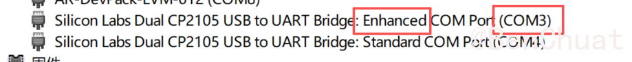
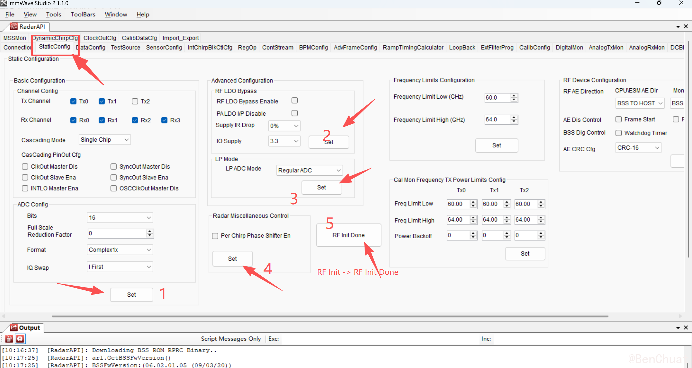
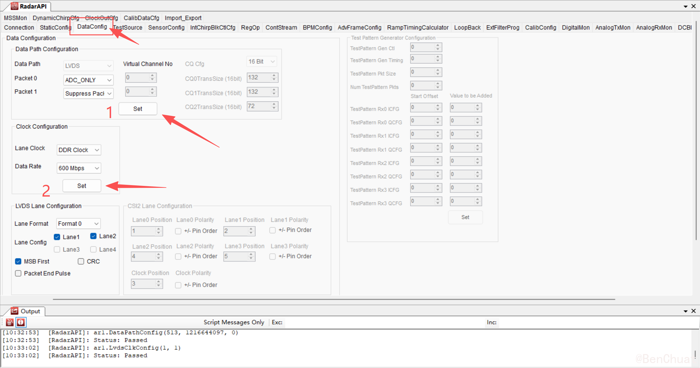
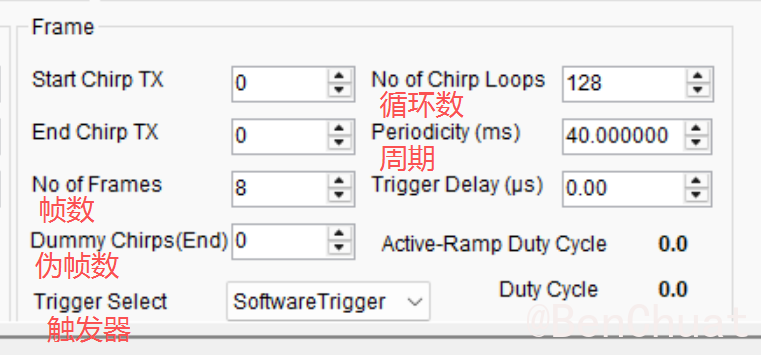
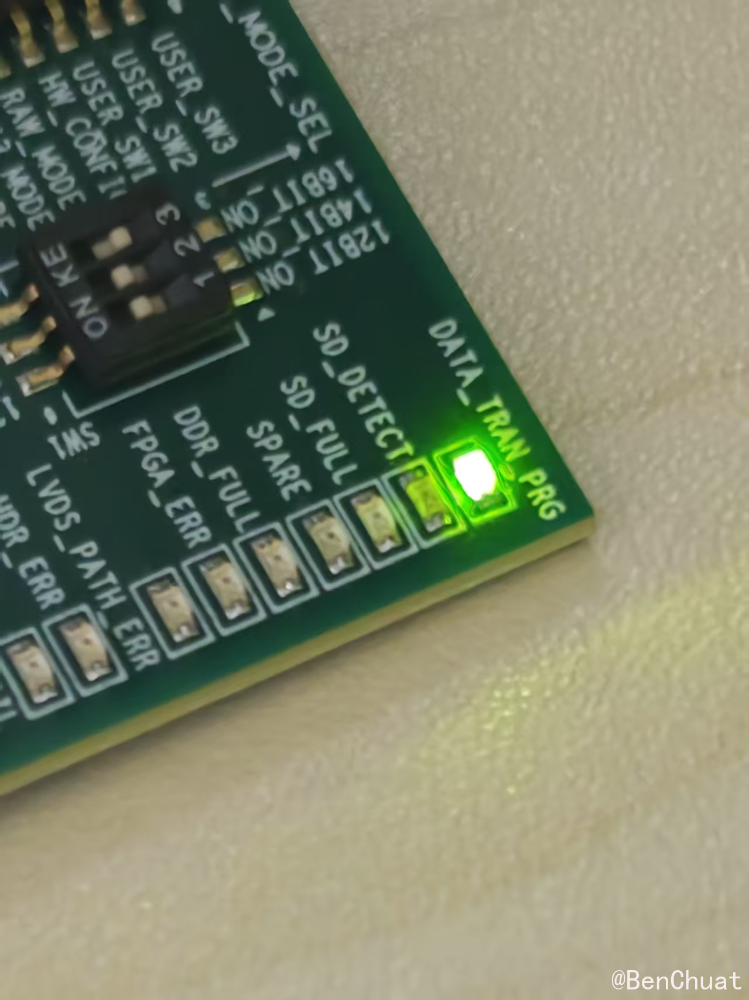

+++
title = "IWR6843ISK-ODS + DCA1000EVM 毫米波雷达波形数据采集完整指南"
date = "2026-01-22T17:16:07.731269+08:00"
lang = "zh-cn"
draft = false
slug = "20260122171607"
categories = []
tags = [ "毫米波雷达",]
featured = false
summary = ""
+++

# IWR6843ISK-ODS + DCA1000EVM 毫米波雷达波形数据采集完整指南

本文介绍如何使用 **TI IWR6843ISK-ODS**（60 GHz 毫米波雷达评估板）配合 **DCA1000EVM** 进行原始波形数据采集，从硬件准备到成功采集并导出数据。

在开始之前，先说明几个关键概念，以便理解后续操作：

- **使用 mmWave Studio + DCA1000EVM 采集原始波形（Raw Data）**：
  - 将 IWR6843ISK-ODS 的 **S1 开关调节成 DCA1000 模式**
  - 配合 DCA1000EVM 进行 LVDS 通道的原始 ADC 数据采集
  - 可以获取完整的 Raw 波形数据用于后续信号处理

- **只使用 ODS 板子（不接 DCA1000）**：
  - 烧录 demo.bin 固件后，将 **S1 开关调节成功能模式**
  - 使用 TI 库里的 **DEMO Visualizer** 配合使用
  - **只能采集点云数据**，无法获取 Raw ADC 波形数据

本文主要讲解使用 **DCA1000EVM 采集 Raw 数据**的完整流程。

------

## 1. 硬件准备

在开始之前，请确保准备好以下硬件：

### 1.1 核心设备

- **IWR6843ISK-ODS 主板**（60 GHz 毫米波雷达评估板）
- **DCA1000EVM 捕获卡**（用于采集原始 ADC 数据）
- **LVDS 连接线缆**（用于连接 ODS 板与 DCA1000EVM）

### 1.2 连接线材

- **USB 数据线**（用于连接 ODS 板到电脑，尽量短、别用显示器/HUB 的口）
- **Ethernet 网线**（用于连接 DCA1000EVM 到电脑，进行数据传输）
- **电源适配器**（可选，5V，2.5A以上5.5mm×2.1mm）


------

## 2. 软件准备

在开始采集数据之前，需要安装和配置相关软件。

### 2.1 操作系统要求

- **Windows 10/11**（mmWave Studio 基本只在 Windows 上用得最顺）

### 2.2 必需软件

1. **mmWave Studio**
   - 下载并安装最新版本的 mmWave Studio（建议 2.1.x 或更高版本）
   - 安装完成后，建议右键快捷方式选择"以管理员身份运行"

2. **CP210x 驱动**
   - ODS 板通过 USB 枚举出串口，需要安装 CP2105 驱动
   - 安装正确后会枚举出 COM 口：增强型 COM 口是应用/用户 UART、标准 COM 口是数据端口

3. **DCA1000 驱动程序**
   - 确保 DCA1000EVM 的网卡驱动正确安装
   - 配置好 DCA1000 的网络 IP 地址

4. **UniFlash**（用于固件烧录）
   - TI 官方提供的固件烧录工具
   - 用于将 demo.bin 文件烧录到 IWR6843ISK-ODS 板中

### 2.3 可选软件工具

- **MATLAB/Python**：用于后续的数据处理和分析


------

## 3. IWR6843ISK-ODS 固件烧录

在使用 DCA1000EVM 进行数据采集之前，需要先将 demo 程序固件烧录到 IWR6843ISK-ODS 板中。本节介绍使用 UniFlash 工具进行固件烧录的完整流程。

### 3.1 准备工作

在开始烧录之前，请确保：

- 已安装 **UniFlash** 工具（TI 官方提供的固件烧录工具）
- 已准备好 **xwr68xx_mmw_demo.bin** 固件文件（安装好软件后自带的）
  - 默认路径：`C:\ti\mmwave_sdk_03_06_02_00-LTS\packages\ti\demo\xwr68xx\mmw\xwr68xx_mmw_demo.bin`
  - 如果路径不同，请根据实际安装的 SDK 版本调整路径
- 已安装 CP210x 驱动，确保能够识别 COM 口
- 准备好 Micro-USB 数据线，用于连接 IWR6843ISK-ODS 到电脑

P260122171607.assets/2dbcb20fead2.png"

### 3.2 认识 COM 口

插上 USB 后，打开「设备管理器」→「端口 (COM 和 LPT)」，一般会看到：

- **Silicon Labs Dual CP2105… Enhanced COM Port (COMx)**
- **Silicon Labs Dual CP2105… Standard COM Port (COMy)**

 **重要提示**：
> - SOP 模式只在板子上电时读取，所以设置完开关后需要按 RESET 或断电重启
> - 如果开关设置错误，UniFlash 将无法识别板子或烧录失败

### 3.4 使用 UniFlash 烧录固件

#### 步骤 1：打开 UniFlash 并选择设备

1. 打开 **UniFlash** 工具
2. 在设备选择界面，选择 **IWR6843ISK**
3. 点击 **Start** 按钮开始

#### 步骤 2：配置烧录参数

1. **选择固件文件**：
   - 点击 **Load Image** 或类似按钮
   - 浏览并选择 **xwr68xx_mmw_demo.bin** 文件
   - 默认路径：`C:\ti\mmwave_sdk_03_06_02_00-LTS\packages\ti\demo\xwr68xx\mmw\xwr68xx_mmw_demo.bin`

2. **设置串口**：
   - 选择之前识别到的 **Enhanced COM Port**（例如 COM3）
   - 确保串口设置正确，波特率通常使用默认值

#### 步骤 3：开始烧录

1. 点击 **Load Image** 按钮开始烧录过程
2. **等待烧录完成**：
   - 烧录过程大约需要几分钟，请耐心等待
   - 可以在控制台（Console）窗口观察烧录进度

#### 步骤 4：验证烧录结果

**烧录成功的标志**：

- 在 UniFlash 下方控制台（Console）窗口会出现绿色的成功提示：
  ```
  [SUCCESS] Program Load completed successfully.
  ```


**如果烧录失败，请按以下步骤排查**：

1. **检查 bin 文件路径**：
   - 确认文件路径中**没有中文字符**
   - 路径中如有中文可能导致烧录失败

2. **检查串口设置**：
   - 确认选择了正确的 Enhanced COM Port
   - 确认串口没有被其他程序占用
   - 可以尝试重新插拔 USB 线，重新识别 COM 口

3. **检查芯片选择**：
   - 确认在 UniFlash 中选择了正确的芯片型号（IWR6843ISK）

4. **清空 Flash 后重试**：
   - 如果一直烧写不成功，可以在 UniFlash 的 **Setting** 菜单中点击 **Format SFLASH** 清空 Flash
   - 清空后重新尝试烧录

### 3.5 烧录完成后的操作

烧录成功后：

1. **将 S1 开关切换回功能模式**：
   - 如果后续要使用 DCA1000EVM，需要将 S1 切换到 DCA1000 模式（MMWAVEICBOOST 模式）
   - 如果只使用 ODS 板，切换到功能模式（Functional Mode）

2. **断电重启**：
   - 修改开关后，务必点击一次REST（S2）按钮或断电重启（拔 USB 再插），使新配置生效

> **注意**：烧录固件后，板子就可以运行 demo 程序了。如果后续要配合 DCA1000EVM 使用，还需要进行硬件连接和网络配置，详见下一章。

------

## 4. 接线准备

### 4.1 连接 IWR6843ISK-ODS 与 DCA1000EVM

#### DCA1000EVM 拨码开关设置

在连接硬件之前，首先需要检查并设置 DCA1000EVM 板上的拨码开关。

DCA1000EVM 上有三个拨码开关，分别是：**SW1**、**SW2**、**S1**。

P260122171607.assets/8bc9fe0c42ed.png"

**开关配置要求**：

- **S1 = 0101**：默认设置，**不要改动**，保持此配置即可
- **SW1 = 110**：需要设置为 110
- **SW2 = 00001000**：需要设置为 00001000

> **注意事项**：
> - 新购买的板子，SW1 和 SW2 可能是随机状态，需要按照上述要求手动设置
> - S1 开关保持默认的 0101 配置，不要修改
> - 修改开关设置后，需要断电重启才能使配置生效

#### IWR6843ISK-ODS 拨码开关设置

使用 DCA1000EVM 进行原始数据捕获的设置：


#### 硬件连接步骤

1. **使用 LVDS 线缆连接**：
   
   P260122171607.assets/c4133dccab49.png"20260122171607.assets/7d0976b70de4.png

   - 将 IWR6843ISK-ODS 的 LVDS 接口与 DCA1000EVM 的对应接口连接
   - 确保连接牢固，接触良好
   
    **注意事项**：
   > - 两种供电方式不要混用，以免造成电源冲突或损坏设备
   > - 板上有一个 "5V" LED 指示灯，用于指示板子是否正确获得 5V 电源
   > - 如果使用外部 DC 电源，建议使用 5V/2.5A 或更高电流的电源适配器

   P260122171607.assets/c25ff776338a.png"

### 4.2 连接到电脑

1. **ODS 板 USB 连接**：
   - 使用 USB 数据线将 IWR6843ISK-ODS 连接到电脑的 USB 口
   - 建议直接连接电脑主板 USB 口，避免通过 HUB 或显示器转接

2. **DCA1000EVM 网络连接与 IP 配置**：

   **步骤 1：物理连接**
   
   - 使用以太网线将 DCA1000EVM 的 Ethernet 接口连接到电脑的网卡接口
- 确保网线质量良好，连接牢固
  

**步骤 2：配置 PC 静态 IP 地址**

为了能够正确与 DCA1000EVM 通信，需要将 PC 的网络接口设置为静态 IP 地址：

   - 打开「控制面板」→「网络和共享中心」→「更改适配器设置」
   - 右键点击连接到 DCA1000EVM 的网卡 →「属性」


   - 选择「Internet 协议版本 4 (TCP/IPv4)」→「属性」

 **重要提示**：
   > - 修改 SW2.6 开关位置后，**必须重启 DCA1000EVM 的电源**（断电重上电）或进行硬件复位（Hardware Reset），才能使新的以太网配置生效
   > - 确保 PC 的静态 IP（192.168.33.30）与 DCA1000EVM 的 IP（192.168.33.180）在同一网段（192.168.33.x）
> - 如果使用 mmWave Studio，通常选择使用 EEPROM 配置（SW2.6 在 Pin6），这样可以通过软件配置和保存网络参数

**步骤 4：验证网络连接**

   - 打开命令提示符（CMD），执行 `ping 192.168.33.180`
   - 如果能够 ping 通，说明网络连接配置正确
   - 如果 ping 不通，检查：
     1. 网线连接是否正常
     2. PC 静态 IP 是否正确设置
     3. SW2.6 开关位置是否正确
     4. DCA1000EVM 是否已正确上电（检查 5V LED 指示灯）

### 4.3 确认连接状态

- 连接完成后，检查所有接口是否连接牢固
- 确保线缆无损坏，接触良好

------

## 6. 连接电脑与设备配置

### 6.1 连接前的检查

确保已完成：
- 硬件连接（ODS 与 DCA1000 的 LVDS 连接、USB 和网线连接）
- S1 开关已调节到 DCA1000 模式
-  驱动已正确安装（CP210x 驱动、DCA1000 驱动）
- 所有设备已上电

 注意：DCA1000上的数据线接的是FTDI（J1）口


### 6.2 检查串口

连接都正确后，电脑打开设备管理器，查看串口，应该能看到两个设备的串口信息。


如果没有的话，去手动安装一下驱动。（路径：C:\ti\mmwave_studio_02_01_01_00\ftdi）


------

## 7. 开始运行：mmWave Studio 连接与配置

### 7.1 启动 mmWave Studio 并连接设备

回到 **RadarAPI → Connection** 页，按照界面上的==蓝色指示顺序==进行操作。建议同时打开 **Output** 窗口查看操作结果，便于检查每一步是否正常执行。

#### 步骤 1：确认设备检测

- 开始任何操作前，先确保 GUI 能够检测到设备，数量应为 1
- 如果检测不到设备，检查硬件连接和驱动是否正确安装


#### 步骤 2：Reset Control

- 直接点击 **Set** 按钮即可==！！一定要记得先点！！==

#### 步骤 3：RS232 Operations（串口连接）

RS232 接口用于雷达设备与 PC 的连接，支持固件加载和命令通信。

- **选择串口**：在 COM Port 下拉菜单中选择 **DCA1000 的 Enhanced COM Port**（用户端口）
  - 注意区分：Enhanced COM Port（用户端口，用于控制）和 Standard COM Port（数据端口）
  - 在设备管理器中可以查看具体的 COM 端口号（例如 COM10）



==注意要根据具体情况选择正确的 COM 端口号==

- **波特率设置**：根据实际情况选择
  - 使用 DCA1000 时，建议选择 **115200**
  - 某些配置下也可能使用默认的 921600，请根据实际情况选择
- 点击 **Connect** 按钮进行连接
- 连接成功后，状态会显示为绿色


#### 步骤 4：Operating Frequency（工作频率）

- 选择 **60 GHz**
- 这是使用 DCA1000EVM 时的标准工作频率

#### 步骤 5：Device Variant（设备类型）

- 选择 **xWR6843** 或 **IWR6843ISK**
- 对应所使用的 60 GHz 毫米波雷达评估板型号

#### 步骤 6：BSS FW（射频固件加载）

BSS（Binary Sub System）固件用于下载 IWR 固件到芯片的射频模块，提供射频相关的软件补丁。

- 在 Firmware Download 区域的 BSS FW 文件选择中，点击 **Browse** 或直接输入路径
- **固件路径示例**：
  
  ```
  D:\ti\mmwave_studio_02_01_01_00\rf_eval_firmware\radarss\xwr68xx_masterss.bin
  ```
- 根据实际安装的 mmWave Studio 版本，路径可能略有不同
- 选择完成后，点击 **Load** 按钮加载 BSS 固件

#### 步骤 7：MSS FW（主控固件加载）

MSS（Master Sub System）固件用于下载 IWR 固件到芯片的通信模块，即 R4F 核心的代码。

- 在 Firmware Download 区域的 MSS FW 文件选择中，点击 **Browse** 或直接输入路径
- **固件路径示例**：
  ```
  D:\ti\mmwave_studio_02_01_01_00\rf_eval_firmware\masterss\xwr68xx_masterss.bin
  ```
- 根据实际安装的 mmWave Studio 版本，路径可能略有不同
- 选择完成后，点击 **Load** 按钮加载 MSS 固件

> **注意**：需要先加载 BSS 固件，再加载 MSS 固件。加载完成后，可以在状态区域看到固件版本信息。

#### 步骤 8：SPI Connect（SPI 连接）

mmWave 雷达设备使用 SPI 接口与外部主机处理器进行通信。SPI 连接成功后才能进行后续的射频评估操作。

- 点击 **SPI Connect** 按钮
- 等待连接完成，状态应显示为绿色

> **故障排查**：如果 SPI 连接失败，可以尝试使用 UniFlash 工具擦除 FPGA 的闪存（SFLASH），然后再重新连接。

#### 步骤 9：RF Power-up（射频上电）

射频上电后，用户可以通过 SPI 通信接口向设备发送命令，并评估射频结果。

- 点击 **RF Power-up** 按钮
- 等待上电完成，确认状态正常

#### 连接成功标志

当以上步骤全部完成后，应该看到以下状态：

- **RS232 Connected**（绿色）
-  **SPI Connected**（绿色）
-  **RF Power-up** 成功

此时，设备已经成功连接并准备就绪，可以进行后续的参数配置和数据采集操作。


> **提示**：建议在整个连接过程中保持 **Output** 窗口打开，以便实时查看每一步的操作结果和可能的错误信息。

### 7.2 配置 DCA1000 连接

在完成设备连接（RS232、SPI、RF Power-up）后，需要配置 DCA1000 数据采集卡：

1. **配置 DCA1000 网络参数**：
   - 在 mmWave Studio 中找到 **DCA1000 Setup** 相关配置
   - 设置正确的 IP 地址（通常需要与 DCA1000EVM 的 IP 地址匹配，如 192.168.33.180）
   - 点击 **Connect** 连接 DCA1000

   
   
2. **确认 FPGA 版本号**：
   - **重要**：连接成功后，必须确认能够读取到 **FPGA 版本号码**
   - 只有在成功获取 FPGA 版本号后，才能正常进行数据采集
   - 如果无法读取 FPGA 版本号，检查网络连接和 DCA1000 配置

   
   

> **重要提示**：DCA1000 Setup 连接成功后，必须确认读取到 FPGA 版本号码，这是后续数据采集的前提条件。

### 7.3 StaticConfig（静态配置）

StaticConfig 用于配置射频基本参数。**注意**：只有在 SPI 和 RF Power-up 成功后才能进行静态配置操作。

#### (1) Channel Config（通道配置）

- 配置发射和接收通道的使用情况
- 设置天线配置以及级联模式
- 根据实际需求选择启用的 TX 和 RX 通道（初学建议使用默认配置，如 3Tx/4Rx）

#### (2) ADC Config（ADC 配置）

配置 ADC 采样相关参数：

- **ADC 采样位数**：设置 ADC 的采样精度
- **ADC 采样输出格式**：选择数据输出格式
- **IQ 采样选择**：配置 IQ 数据的采样方式

配置完成后，直接点击 **Set** 按钮应用配置。

#### (3) Advanced Configuration（高级配置）

高级配置选项，通常使用默认设置即可。

配置完成后，直接点击 **Set** 按钮应用配置。

#### (4) LP Mode（低功耗模式）

选择数字模拟信号输入模式：

- **Regular ADC**：正常模式，使用标准时钟速率
- **Low Power ADC**：低功耗模式，时钟速率降低一半，适用于低功耗应用场景

根据实际需求选择相应的模式。

#### (5) RF Init（射频初始化）

配置完成后，执行射频初始化操作。

直接点击 **RF Init** 按钮执行初始化。



> **操作顺序**：完成以上 StaticConfig 各项配置后，按照顺序点击 Set 按钮，最后执行 RF Init。建议同时查看 Output 窗口确认每一步操作是否成功。

### 7.4 DataConfig（数据配置）

DataConfig 用于配置数据采集相关的参数：

- 设置数据输出格式
- 配置数据包大小和传输方式
- 根据实际需求进行相应配置

配置完成后，点击 **Set** 按钮应用配置。



### 7.5 SensorConfig（传感器配置）

SensorConfig 是传感器配置的核心部分，包含三个关键参数配置：


#### Profile Config（波形配置）

配置雷达发射波形的基本参数：

- **中心频率**：设置雷达工作的中心频率
- **斜率（Slope）**：配置频率调制的斜率
- **采样率**：设置 ADC 采样频率
- **采样点数**：配置每个 chirp 的采样点数


#### Chirp Config（Chirp 配置）

配置每个 chirp 的参数：

- **TX 通道选择**：指定哪些发射通道参与工作
- **对应的 Profile**：关联到之前配置的 Profile
- **Chirp ID**：为每个 chirp 分配唯一标识


#### Frame Config（帧配置）

配置帧级别的参数：

- **每帧 chirp 数**：设置一帧包含多少个 chirp
- **帧周期**：配置帧与帧之间的时间间隔
- **帧数**：设置总共采集多少帧数据



> **小建议**：如果只是验证"能发能收"，建议使用 mmWave Studio 自带的示例脚本或配置，或者从官方推荐的 profile 起步，避免参数组合不当导致"看不到回波"。

### 7.6 开始数据采集

完成以上所有配置后，可以开始数据采集，按步骤操作：


- 第4步选择C:\ti\mmwave_studio_02_01_01_00\mmWaveStudio\PostProc\adc_data.fig

- 第5确定DCA 1000链接成功，出现版本号FPGA Vervion。

- 点击6后等待2秒后点击7点击Trigger Frame，LED灯DATA_TRAN_RPG绿光不停闪烁，表明正在获取数据。

  

- 在数据获取结束之后（或点击8结束采集），LED灯DATA_TRAN_RPG绿光闪烁一次，并保持常绿。表明数据获取成功。
- 点击9则自动调用MATLAB画出本次的数据情况。
- Frame中的No of Frames代表采集的帧数，可以通过改变帧数控制采集时间。

**监控采集过程**：

- 建议在整个采集过程中保持 **Output** 窗口打开
- 正常执行时，记录获取的结果和调试信息，方便后续对比和问题排查
- 如果出现错误，及时查看 Output 窗口的错误信息

------

## 8. 读取数据

### 8.1 数据采集过程监控

在数据采集过程中，注意观察：

- mmWave Studio 界面中的数据采集状态
- 采集帧数进度
- 是否有错误提示

### 8.2 Raw 数据文件格式

使用 DCA1000 采集的数据通常以 **二进制文件（.bin）** 格式保存：

- 文件包含原始 ADC 采样数据
- 数据按照配置的 Profile/Chirp/Frame 参数组织
- 文件大小取决于采集帧数、采样点数等参数

### 8.3 数据保存位置

- 数据文件保存在 mmWave Studio 中指定的路径，通常是：C:\ti\mmwave_studio_02_01_01_00\mmWaveStudio\PostProc

  

  **`adc_data_Raw_0.bin`**
   该文件存储由毫米波雷达前端经 LVDS 接口输出并通过 DCA1000 采集的原始 ADC 复数采样数据，是后续距离、多普勒及角度信号处理的基础数据源。

  **`adc_data_Raw_LogFile.csv`**
   该文件记录了 ADC 数据采集过程中的关键参数与统计信息，用于描述原始数据的组织结构并辅助对二进制数据文件的正确解析。

  **`cf.json`**
   该文件保存了本次数据采集所采用的雷达工作参数与 DCA1000 配置，实现对实验条件的完整记录与可复现性描述。

  **`CLI_LogFile.txt`**
   该文件记录了数据采集过程中通过命令行接口下发的控制指令及系统响应信息，用于验证采集流程的正确性与调试异常情况。

------

## 9. 观察数据

### 8.1 在 mmWave Studio 中实时观察

mmWave Studio 提供了一些实时数据可视化功能：

- **Range Profile**：距离剖面图，显示不同距离处的回波强度
- **Range-Doppler Map**：距离-多普勒图（如支持）
- **其他可视化**：根据 mmWave Studio 版本可能还有其他图表

### 8.2 使用后处理工具观察

采集完 Raw 数据后，可以使用以下工具进行观察和分析：

1. **MATLAB**：
   - 使用 TI 提供的 MATLAB 后处理脚本
   - 可以绘制 Range Profile、Range-Doppler Map 等

2. **Python**：
   - 使用相应的 Python 库读取和解析 .bin 文件
   - 使用 matplotlib 等库进行数据可视化

### 8.3 数据理解

- **Range Profile**：显示目标在不同距离处的反射强度，可以用于目标检测和测距
- **Raw ADC 数据**：包含完整的接收信号信息，可用于后续的信号处理和分析

## 结语

本文介绍了使用 **IWR6843ISK-ODS + DCA1000EVM** 进行毫米波雷达波形数据采集的完整流程，从硬件准备到数据导出。关键步骤包括：

1. **硬件连接**：正确连接 ODS 板与 DCA1000EVM
2. **开关配置**：将 S1 开关调节到 DCA1000 模式（MMWAVEICBOOST 模式）
3. **软件配置**：安装驱动、配置网络、连接设备
4. **参数设置**：配置雷达参数和采集参数
5. **数据采集**：启动采集并监控状态
6. **数据处理**：读取、观察和导出数据

------