+++
title = "一篇把 mmWave Studio 参数“讲透”的 FMCW 雷达配置（原理篇）"
date = "2026-01-25T18:49:31.947938+08:00"
lang = "zh-cn"
draft = false
slug = "20260125184931"
categories = []
tags = [ "毫米波雷达",]
featured = false
summary = ""
+++

# 一篇把 mmWave Studio 参数“讲透”的 FMCW 雷达配置（原理篇）

## 1. 参数概览：可调项、示例配置、基本原理

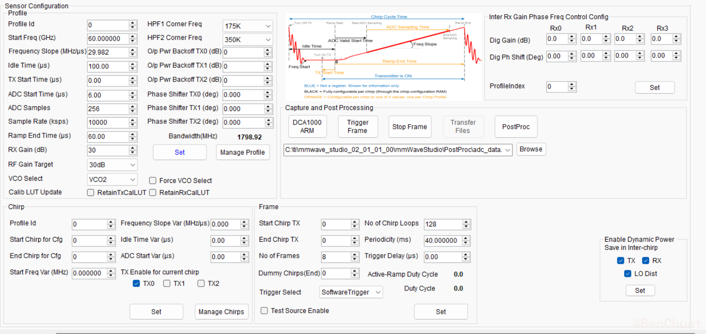

### 1.1 哪些参数可调？示例参数是什么？

**(1) Profile（单条 chirp 的“物理形状”和采样）**

- 频率/扫频：Start Freq $f_0$，Frequency Slope $S$，Ramp End Time $T_\text{ramp}$（决定 Bandwidth $B$）
- 时序：Idle Time $T_\text{idle}$，ADC Start Time $T_\text{ADCstart}$
- 采样：ADC Samples $N_s$，Sample Rate $F_s$
- 链路：HPF1/HPF2（高通截止），RX Gain，TX backoff（每路 TX），Phase Shifter（每路 TX）

**(2) Chirp（对每条 chirp 做微调）**
- Start Freq Var、Frequency Slope Var、Idle Time Var、ADC Start Var（当前示例都为 0）

**(3) Frame（把 chirp 组织成帧/序列）**
- No of Chirp Loops $N_\text{chirp}$，Periodicity $T_\text{frame}$，No of Frames $N_\text{frame}$，Trigger Delay，Dummy Chirps(End)

**当前截图示例（基准配置 A）**
- $f_0=60\,\text{GHz}$，$S=29.982\,\text{MHz}/\mu s$，$T_\text{ramp}=60\,\mu s$
- $T_\text{idle}=100\,\mu s$，$T_\text{ADCstart}=6\,\mu s$
- $N_s=256$，$F_s=10\,\text{Msps}$
- HPF1/HPF2：175kHz / 350kHz
- RX Gain=30dB，TX backoff=0dB，仅 TX0 使能
- $N_\text{chirp}=128$，$T_\text{frame}=40\,\text{ms}$，$N_\text{frame}=8$

### 1.2 基本原理一句话（够用即可）
- FMCW 线性 chirp：$f(t)=f_0+St$
- 带宽：$B=S\,T_\text{ramp}$，距离分辨率：$\Delta R=\frac{c}{2B}$
- 采样窗：$T_\text{sampling}=\frac{N_s}{F_s}$，并需满足 $T_\text{ramp} > T_\text{ADCstart}+T_\text{sampling}+T_\text{excess}$
- 单 chirp 周期：$T_c=T_\text{idle}+T_\text{ramp}$，帧内有效时长：$T_\text{active}=N_\text{chirp}T_c$，帧间空闲：$T_\text{IFidle}=T_\text{frame}-T_\text{active}$

---

## 2. 距离分辨率与距离谱质量

### 2.0 先解释几个名词：距离分辨率、距离谱（Range FFT）、带宽

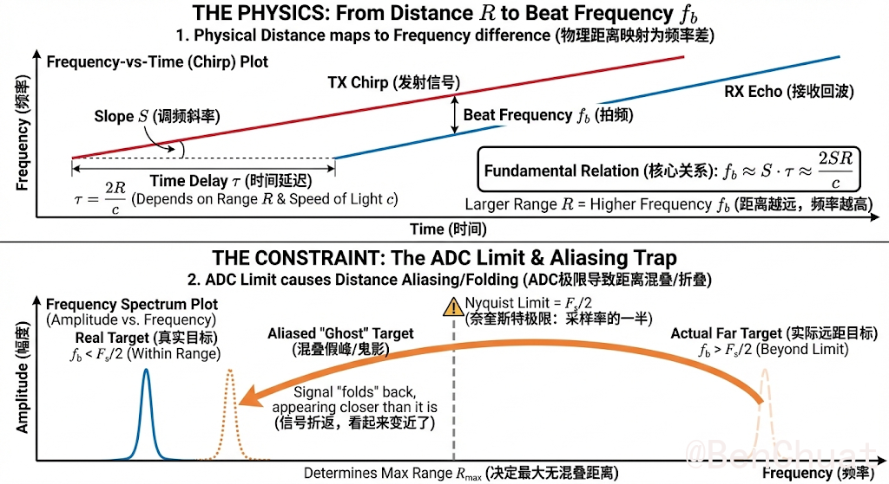

- **距离分辨率 $\Delta R$（Range Resolution）**  
  表示雷达在“距离方向”能分开两个目标的最小间隔。  
  **现实含义**：两个物体如果相距小于 $\Delta R$，在距离谱里往往会“糊在一起”变成一个峰；相距大于 $\Delta R$，更可能出现两个可分辨的峰。
- **距离谱（Range Profile / Range FFT）**  
  对每条 chirp 的快时间采样做 FFT 得到的频谱，再按“拍频 $\rightarrow$ 距离”的映射换算成距离轴。  
  **现实含义**：距离谱上的每一个峰，通常对应某个距离处的散射体（目标或反射面）。峰越尖、旁瓣越低，越容易判断真实目标位置。
- **带宽 $B$（Bandwidth）**  
  一条 chirp 在 ramp 期间扫过的频率范围。  
  **现实含义**：带宽越大，距离分辨率越好；就像相机的“分辨率”更高，能看清更细的距离结构。

### 2.1 距离分辨率（$\Delta R$）

#### 2.1.1 参数如何影响测距（原理）

**核心链路：$S$ 与 $T_\text{ramp}$ 决定 $B$，$B$ 决定 $\Delta R$**
$$
B=S\,T_\text{ramp}
$$
$$
\Delta R=\frac{c}{2B}
$$

基准配置 A：
$$
B=29.982\times 60=1798.92\,\text{MHz}
$$
$$
\Delta R\approx \frac{3\times10^8}{2\times1.79892\times10^9}\approx 0.083\,\text{m}
$$

> 直觉：$S$ 或 $T_\text{ramp}$ 增大 → 带宽增大 → 距离分辨率更好；但过大的 $S$ 会推高拍频，对采样率/模拟带宽更苛刻（见第 3 节）。

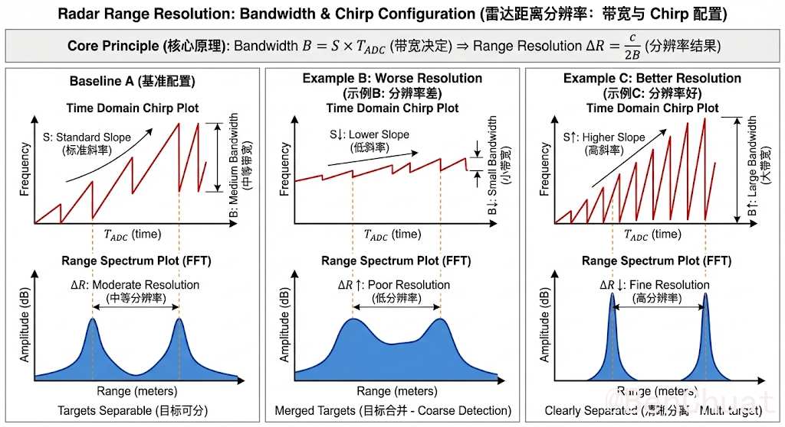

#### 2.1.2举例两组不同的数据

**示例 B（分辨率更差）**：$S=15\,\text{MHz}/\mu s$，$T_\text{ramp}=60\,\mu s$
$$
B=15\times60=900\,\text{MHz},\quad
\Delta R\approx \frac{3\times10^8}{2\times9\times10^8}=0.167\,\text{m}
$$

**示例 C（分辨率更好）**：$S=40\,\text{MHz}/\mu s$，$T_\text{ramp}=60\,\mu s$
$$
B=40\times60=2400\,\text{MHz},\quad
\Delta R\approx \frac{3\times10^8}{2\times2.4\times10^9}=0.0625\,\text{m}
$$

### 2.2 应用场景

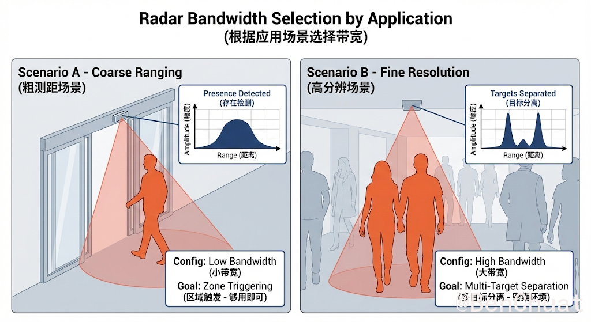

- **多目标分离（近距离多个散射点/多人/反射体密集）**：优先提高 $B$（提升 $\Delta R$）。
- **只需粗测距（存在检测/区域触发）**：$B$ 够用即可，把预算留给帧率与稳定性。

---

## 3. 最大测距与距离混叠（量程、折叠、假峰）

### 3.0 先解释几个名词：拍频、混叠、无混叠距离

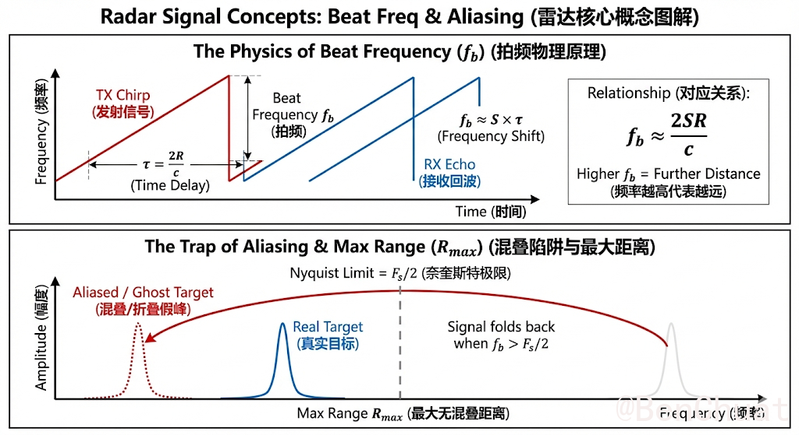

- **拍频 $f_b$（Beat Frequency）**  
  FMCW 雷达把“发射 chirp”和“目标回波”做混频（相当于两条频率很接近的信号相乘），输出一个低频信号，其主频率就是拍频 $f_b$。  
  **现实含义**：拍频越高，通常代表目标越远（在静止目标情况下），因为回波延迟更大。

- **（静止目标）拍频与距离的对应**  
  目标距离 $R$ 造成往返时延 $\tau=\frac{2R}{c}$，在扫频斜率为 $S$ 时，回波相对发射的“频率错位”约为 $S\tau$，因此静止目标拍频近似：
  $$
  f_b\approx S\tau=\frac{2SR}{c}
  $$
  **现实含义**：同一套配置下，你看到的“拍频谱峰值位置”可以直接换算成距离。

- **混叠（Aliasing）/ 折叠**  
  ADC 以采样率 $F_s$ 采样时，能够正确表示的最高频率大约是 $F_s/2$（Nyquist）。如果拍频超过这个上限，频谱会“折回”到低频区，看起来像一个假的低拍频峰。  
  **现实含义**：远处目标可能被“折叠”到近处，形成**假峰**或距离跑偏。

- **最大无混叠距离 $R_\text{max}$**  
  就是“拍频刚好不超过 $F_s/2$ 时对应的最大距离”。超过它的目标可能产生折叠。

---

### 3.1 最大无混叠距离（$R_\text{max}$）

#### 3.1.1 参数如何影响量程（原理）

静止目标拍频近似：
$$
f_b\approx \frac{2SR}{c}
$$

采样率决定最大可采拍频（Nyquist）：
$$
f_{b,\max}\approx \frac{F_s}{2}
$$

映射到最大无混叠距离（常用估算）：
$$
R_\text{max}\approx \frac{c}{2S}\cdot\frac{F_s}{2}=\frac{cF_s}{4S}
$$

基准配置 A（$F_s=10\,\text{Msps}$，$S=29.982\,\text{MHz}/\mu s$）：
$$
R_\text{max}\approx \frac{3\times10^8\times10\times10^6}{4\times29.982\times10^{12}}\approx 25\,\text{m}
$$

> 直觉：提高 $F_s$ 增量程；提高 $S$ 减量程（用分辨率换量程）。

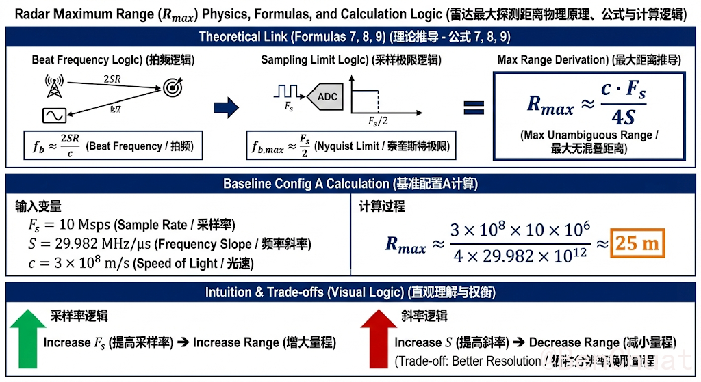

#### 3.1.2（举例）两组不同的数据

**示例 D（降低采样率，量程下降）**：$F_s=5\,\text{Msps}$，$S$ 同 A
$$
R_\text{max}\approx \frac{3\times10^8\times5\times10^6}{4\times29.982\times10^{12}}\approx 12.5\,\text{m}
$$

**示例 E（降低斜率，量程显著增大）**：$S=10\,\text{MHz}/\mu s$，$F_s=10\,\text{Msps}$
$$
R_\text{max}\approx \frac{3\times10^8\times10\times10^6}{4\times10\times10^{12}}\approx 75\,\text{m}
$$

### 3.2 应用场景

- **中远距离测距（走廊/道路/大空间）**：优先保证 $R_\text{max}$（降低 $S$ 或提高 $F_s$）。
- **近距离感知（桌面/人体近距）**：量程不是瓶颈，更重要的是近距可见性和不过载（见第 5、6 节）。

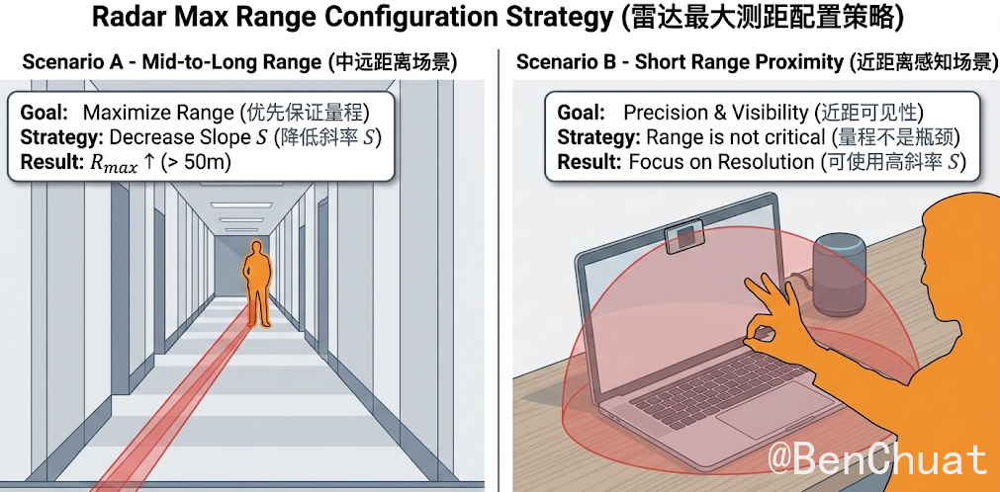

---

## 4. 测速与运动解析（无模糊速度、速度分辨率、帧内 chirp 数）

### 4.0 先解释几个名词：多普勒、无模糊速度、速度分辨率

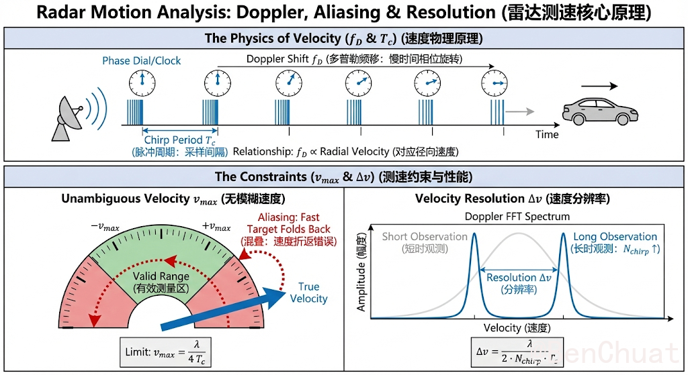

- **多普勒频移 $f_D$（Doppler Shift）**  
  目标在径向方向运动时，回波会产生频率偏移（类似救护车鸣笛靠近/远离时音调变化）。  
  **现实含义**：你在数据里看到的“慢时间上的相位旋转/频率偏移”对应目标的径向速度。

- **chirp 周期 $T_c$（Chirp Repetition Interval）**  
  相邻两条 chirp 的时间间隔，通常由 $T_\text{idle}+T_\text{ramp}$ 构成。  
  **现实含义**：雷达“多普勒采样”的采样间隔。$T_c$ 越小，速度采样越密。

- **无模糊速度 $v_\text{max}$（Unambiguous Velocity）**  
  由于速度是在“离散时间采样（每隔 $T_c$ 采一次）”下估计的，速度也会像频率一样发生混叠。  
  **现实含义**：当目标速度超过 $v_\text{max}$ 时，估计的速度会折叠到一个错误的速度值（看起来变慢或方向错）。

- **速度分辨率 $\Delta v$（Velocity Resolution）**  
  一帧内用 $N_\text{chirp}$ 条 chirp 做 Doppler FFT，相当于观测时长约为 $N_\text{chirp}T_c$。观测越久，频率（速度）分辨越细。  
  **现实含义**：$\Delta v$ 越小，你越能分开两个接近的速度（或把慢速变化测得更细）。

---

### 4.1 速度无模糊范围（$v_\text{max}$）与速度分辨率（$\Delta v$）

#### 4.1.1 参数如何影响测速（原理）

单 chirp 周期：
$$
T_c=T_\text{idle}+T_\text{ramp}
$$

载波波长（以 $f_c\approx 60\,\text{GHz}$ 为例）：
$$
\lambda=\frac{c}{f_c}\approx \frac{3\times10^8}{60\times10^9}=0.005\,\text{m}
$$

常用近似（单 TX、等间隔 chirp）：
$$
v_\text{max}\approx \frac{\lambda}{4T_c}
$$

若一帧使用 $N_\text{chirp}$ 条 chirp 做 Doppler FFT：
$$
\Delta v\approx \frac{\lambda}{2N_\text{chirp}T_c}
$$

基准配置 A：$T_c=100+60=160\,\mu s$，$N_\text{chirp}=128$
$$
v_\text{max}\approx \frac{0.005}{4\times160\times10^{-6}}\approx 7.81\,\text{m/s}
$$

$$
\Delta v\approx \frac{0.005}{2\times128\times160\times10^{-6}}\approx 0.122\,\text{m/s}
$$

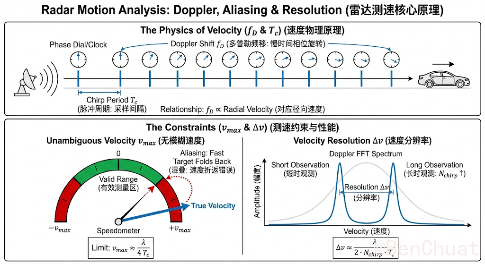

#### 4.1.2（举例）两组不同的数据

**示例 F（提高 $v_\text{max}$：减小 Idle）**：$T_\text{idle}=40\,\mu s$，$T_\text{ramp}=60\,\mu s\Rightarrow T_c=100\,\mu s$
$$
v_\text{max}\approx \frac{0.005}{4\times100\times10^{-6}}=12.5\,\text{m/s}
$$

**示例 G（提高 $\Delta v$ 分辨率：增大 loops）**：$N_\text{chirp}=256$，$T_c$ 同 A
$$
\Delta v\approx \frac{0.005}{2\times256\times160\times10^{-6}}\approx 0.061\,\text{m/s}
$$

### 4.2 应用场景

- **手势/快速运动**：优先提高 $v_\text{max}$（减小 $T_c$，主要靠减 Idle）。
- **慢速精细测速（步态、细微运动）**：增大 $N_\text{chirp}$ 提升速度分辨率，但会压缩帧周期预算（见第 7 节）。

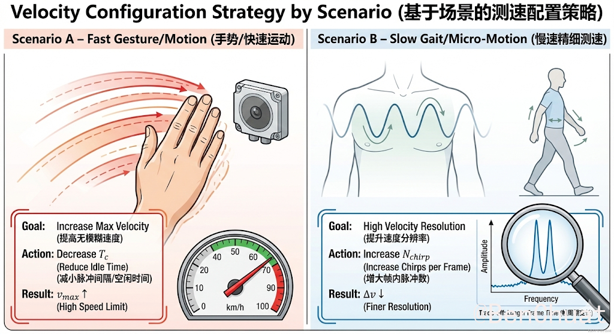

---

## 5. 近距离可见性与静态杂波（HPF 对“近距”和泄漏的影响）

### 5.0 先解释几个名词：泄漏、静态杂波、HPF 截止频率

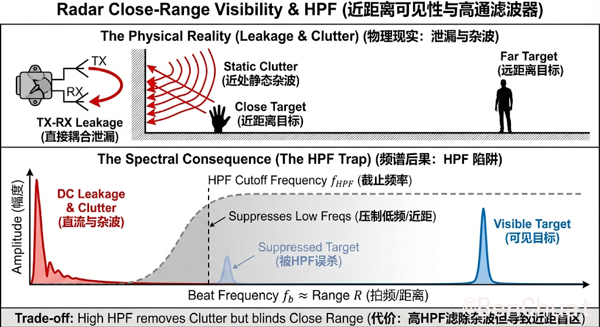

- **泄漏（TX-RX Leakage / Self-Interference）**  
  发射端与接收端之间会存在直接耦合（天线隔离不完美、板级走线耦合等），即使前方没有目标，接收端也会看到一个很强的“自干扰”分量，通常集中在**直流/极低频**附近。  
  **现实含义**：你会在距离谱最靠前（近零距离）看到很强的能量，甚至抬高整个噪声底。

- **静态杂波（Static Clutter）**  
  环境中不动的物体（墙、桌面、地面、固定支架）产生稳定回波。对 FMCW 而言，这些回波也会在拍频域形成稳定分量，尤其在**低拍频**区域能量很大。  
  **现实含义**：如果你只想看运动目标或远处目标，静态背景会把低频区“糊住”。

- **高通滤波器 HPF 与截止频率 $f_\text{HPF}$**  
  HPF 会衰减低于截止频率的拍频分量，用来压制泄漏与静态杂波。  
  **现实含义**：HPF 设得越高，低频（对应近距离、强泄漏、静态背景）压得越狠；但代价是**近距离目标也会被一起压掉**。

- **“近距离为何会被 HPF 影响？”**  
  静止目标的拍频与距离近似成正比：
  $$
  f_b\approx \frac{2SR}{c}
  $$
  距离越近，拍频越低，越容易落在 HPF 的抑制频段里。

---

### 5.1 HPF 对近距的“切除效应”

#### 5.1.1 参数如何影响近距离（原理）

静止目标拍频：
$$
f_b\approx \frac{2SR}{c}
$$
若高通截止为 $f_\text{HPF}$，对应的“等效最小可见距离”近似：
$$
R_{\min,\text{HPF}}\approx \frac{c}{2S}f_\text{HPF}
$$

基准配置 A（$S=29.982\,\text{MHz}/\mu s$）：
- HPF1=175kHz
$$
R_{\min}\approx \frac{3\times10^8}{2\times29.982\times10^{12}}\times175\times10^3\approx 0.875\,\text{m}
$$
- HPF2=350kHz
$$
R_{\min}\approx 1.75\,\text{m}
$$

> 直觉：HPF 越高，越能压 DC/泄漏/静态杂波，但越“看不见”近距离目标。

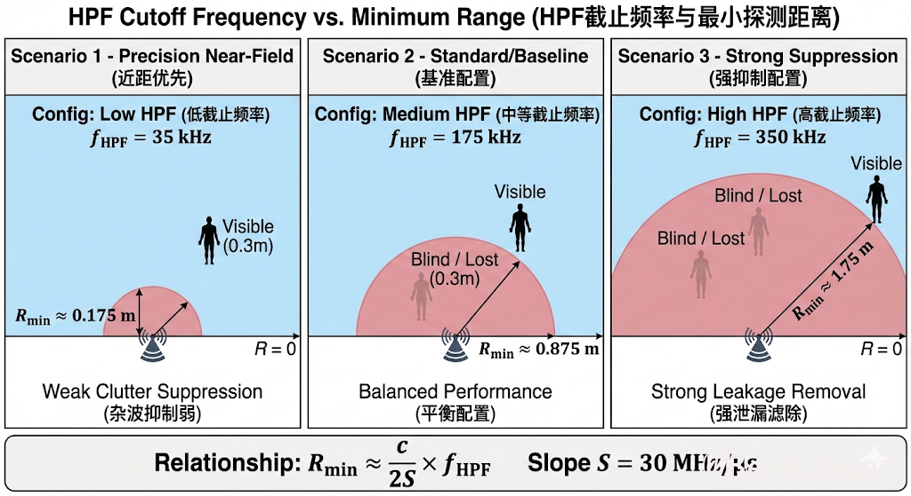

#### 5.1.2（举例）两组不同的数据

**示例 H（更适合 0.3m 近距：降低 HPF）**：$f_\text{HPF}=35\,\text{kHz}$
$$
R_{\min}\approx \frac{3\times10^8}{2\times29.982\times10^{12}}\times35\times10^3\approx 0.175\,\text{m}
$$

**示例 I（更强抑制近距/泄漏：提高 HPF）**：$f_\text{HPF}=700\,\text{kHz}$
$$
R_{\min}\approx 3.5\,\text{m}
$$

### 5.2 应用场景

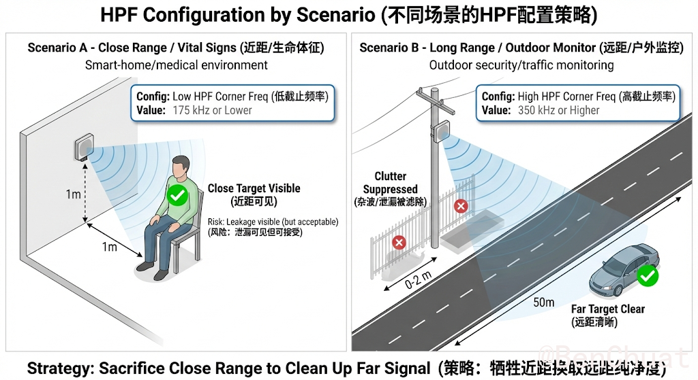

- **喉部/胸口/桌面近距（0–1m）**：HPF 建议尽量低，否则近距被显著衰减，易出现“远处多径假峰更显眼”。
- **远距离 + 强静态背景**：可提高 HPF 抑制泄漏/静态杂波，牺牲近距无所谓。

---

## 6. 动态范围、SNR 与饱和（RX Gain / TX backoff）

### 6.0 先解释几个名词：SNR、动态范围、饱和/削顶、非线性杂散

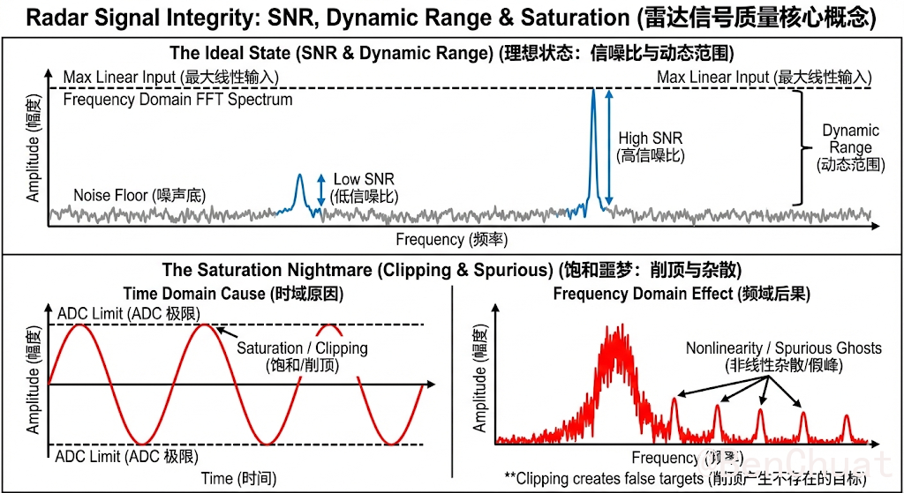

- **SNR（Signal-to-Noise Ratio，信噪比）**  
  信号幅度相对于噪声底的强弱。  
  **现实含义**：SNR 越高，你在距离谱/多普勒谱里越容易把目标峰从噪声里“抠出来”；SNR 太低时目标会淹没在噪声底，表现为峰不稳定、检测不到。

- **动态范围（Dynamic Range）**  
  接收链路能同时处理的“最强信号”和“最弱信号”的跨度。  
  **现实含义**：场景里可能同时存在近距离强反射（很强）和远距离弱目标（很弱）。动态范围不够时，要么强信号把前端顶饱和，要么为了不饱和而把增益降太低导致弱目标看不见。

- **饱和/削顶（Saturation / Clipping）**  
  当前端放大器或 ADC 输入超过其可线性表示的范围，波形被“截平”。  
  **现实含义**：距离谱会出现异常的宽底噪、假峰、旁瓣异常；相位会突变，微动/测速也会变得不可信。

- **非线性与杂散（Nonlinearity / Spurious）**  
  在饱和或接近饱和时，系统产生谐波、互调等非线性产物，映射到频谱里就是额外的“假峰/条纹”。  
  **现实含义**：你可能会看到并不存在的目标峰，或者真实峰被污染难以判断。

- **TX backoff 与 RX Gain 的直觉角色**  
  - TX backoff 本质是在“源头”把发射功率压下去，减少进入接收机的强回波/泄漏。  
  - RX Gain 是在“接收端”把信号整体放大，既放大目标也放大噪声与干扰。

---

### 6.1 为什么会饱和？如何用参数控制？

#### 6.1.1 参数如何影响（原理）

回波强度随 $R$ 迅速衰减（趋势可由雷达方程理解）：
$$
P_r \propto \frac{P_t\,G_t\,G_r\,\lambda^2\,\sigma}{R^4}
$$

- **TX backoff 增大** → $P_t$ 下降 → 回波变弱（SNR 下降），但饱和/非线性/杂散风险下降。
- **RX Gain 增大** → ADC 输入变大（弱目标更容易看到），但强反射/近距泄漏时更容易削顶饱和。

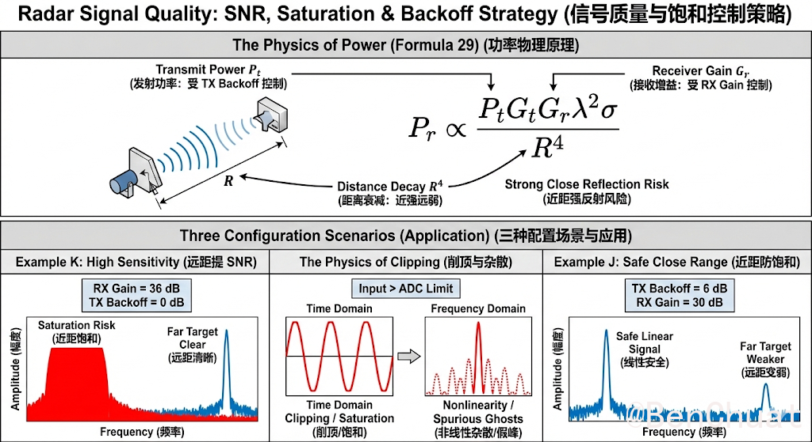

#### 6.1.2（举例）两组不同的数据

**示例 J（近距防饱和）**：TX backoff = 6 dB，RX Gain 仍 30 dB  

- 近距离强反射时削顶风险明显降低；代价是远距离弱目标可能沉到噪声里。

**示例 K（远距提 SNR）**：RX Gain = 36 dB，TX backoff 仍 0 dB  

- 远距弱目标更清晰；代价是遇到近距强反射更容易饱和，距离谱出现假峰/底噪抬升。

### 6.2 应用场景

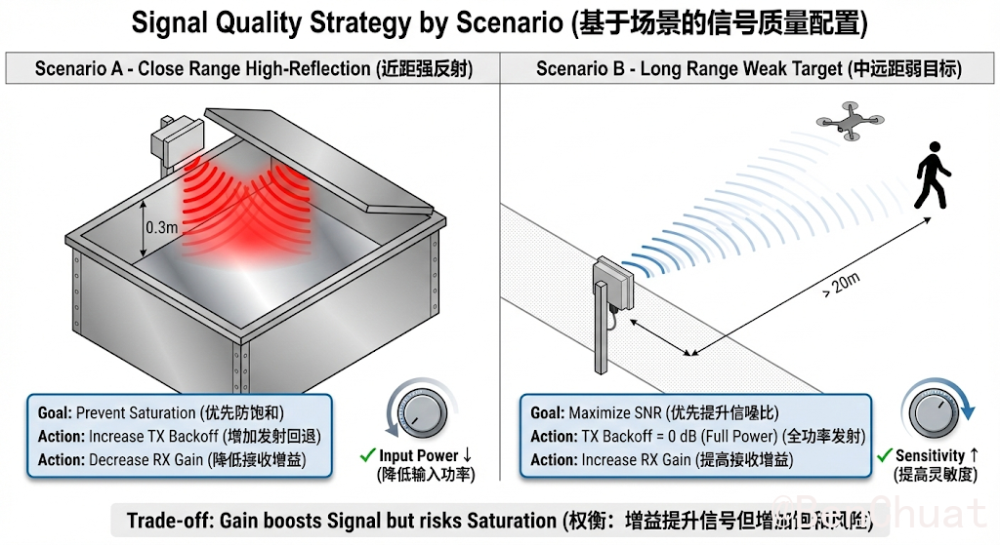

- **近距离（<1m）**：优先不饱和（适当降低 RX Gain 或增加 TX backoff）。
- **中远距离弱目标**：优先 SNR（适当提高 RX Gain，前提是不饱和）。

---

## 7. 时序可行性与实时性（采样窗约束、帧周期约束、数据率）

### 7.0 先解释几个名词：采样窗、ramp、帧周期、帧内有效时间、数据率

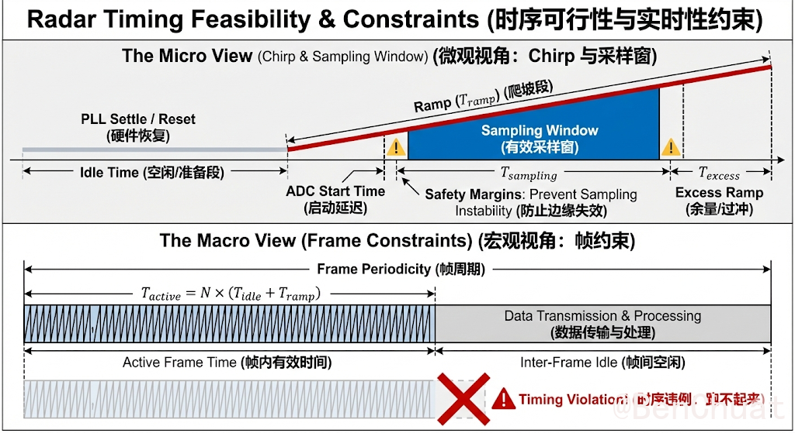

- **ramp（扫频段）与 Idle（空闲段）**  
  一条 FMCW chirp 通常由“空闲/准备段（Idle）”+“线性扫频段（ramp）”组成。  
  **现实含义**：你只有在 ramp 的线性稳定区采到的 ADC 数据，才适合做距离 FFT；Idle 主要用于硬件恢复、PLL 稳定、时序对齐。

- **采样窗（Sampling Window）**  
  指 ADC 实际采样的那段时间，长度为 $T_\text{sampling}$，起点由 $T_\text{ADCstart}$ 决定。  
  **现实含义**：采样窗放得太靠前会吃到瞬态，太靠后会越过 ramp 末尾导致无效数据；采样窗的“摆放”直接决定数据能不能用、谱干不干净。

- **Excess ramp（余量/过冲）$T_\text{excess}$**  
  ramp 末尾预留的一小段不用于采样/用于留裕量的时间。  
  **现实含义**：防止采样贴边，给模拟链路、扫频非理想段留缓冲；忽略它容易导致“理论能装下，实际边缘失真”。

- **帧周期（Frame Periodicity）$T_\text{frame}$**  
  相邻两帧开始的时间间隔。  
  **现实含义**：决定帧率 $f_\text{frame}=1/T_\text{frame}$，直接影响实时性与刷新速度。

- **帧内有效时间（Active Frame Time）$T_\text{active}$**  
  一帧内真正发射/采集 chirp 的持续时间。  
  **现实含义**：如果 $T_\text{active}$ 已经接近甚至超过 $T_\text{frame}$，系统就没有帧间空闲来传输、处理或恢复，配置可能跑不起来或表现异常。

- **数据率（Data Rate）**  
  由采样率、采样点数、chirp 数、RX 通道数等共同决定。  
  **现实含义**：数据率过高会导致 DCA/链路丢包、缓存溢出、处理跟不上，表现为丢帧、数据断裂、谱不稳定。

---

### 7.1 两个最重要的“能不能跑”的约束

#### 7.1.1 参数如何影响（原理）

**(1) 采样窗必须装进 ramp**
$$
T_\text{sampling}=\frac{N_s}{F_s}
$$

$$
T_\text{ramp} > T_\text{ADCstart}+T_\text{sampling}+T_\text{excess}
$$

**(2) 帧周期必须装下帧内 burst**
$$
T_c=T_\text{idle}+T_\text{ramp}
$$

$$
T_\text{active}=N_\text{chirp}T_c
$$

$$
T_\text{frame}\ge T_\text{active}
$$

基准配置 A：
$$
T_c=100+60=160\,\mu s
$$

$$
T_\text{active}=128\times160\,\mu s=20.48\,\text{ms}
$$

$T_\text{frame}=40\,\text{ms}$，满足 $40\ge 20.48$。

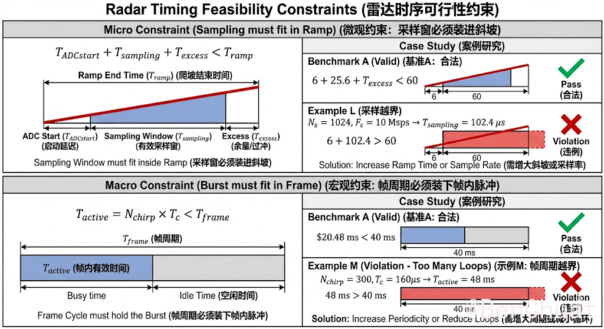

#### 7.1.2（举例）两组不同的数据

**示例 L（采样点过多导致越界）**：$N_s=512$，$F_s=10\,\text{Msps}$，$T_\text{ADCstart}=10\,\mu s$
$$
T_\text{sampling}=\frac{512}{10\times10^6}=51.2\,\mu s
$$

$$
T_\text{ADCstart}+T_\text{sampling}=61.2\,\mu s>60\,\mu s
$$

→ 需要增大 $T_\text{ramp}$ 或提高 $F_s$ 或减小 $N_s$。

**示例 M（loops 过大导致帧周期装不下）**：$N_\text{chirp}=256$，其余同 A
$$
T_\text{active}=256\times160\,\mu s=40.96\,\text{ms}>40\,\text{ms}
$$
→ 需要增大 $T_\text{frame}$ 或减小 $T_c$（减 Idle/减 ramp）或减 loops。

### 7.2 应用场景

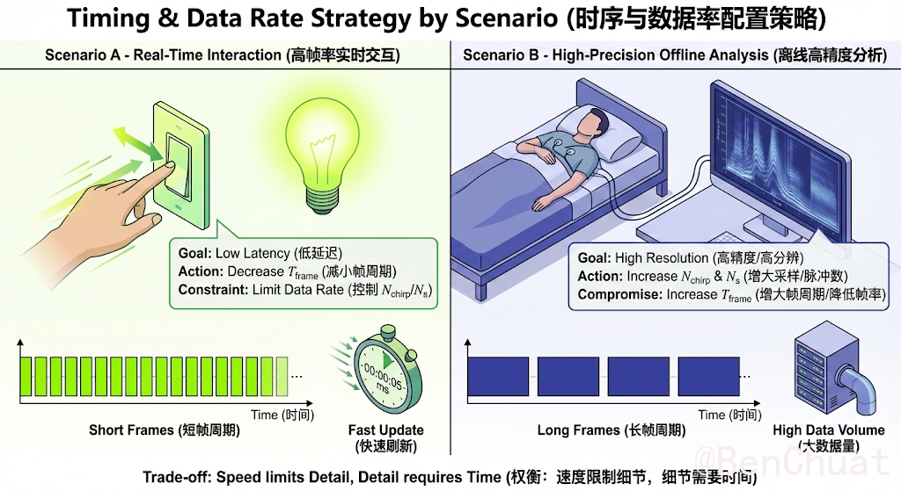

- **高帧率实时交互**：减小 $T_\text{frame}$ 同时必须保证 $T_\text{frame}\ge T_\text{active}$，并控制数据率（$N_s$、$N_\text{chirp}$ 别太大）。
- **离线高精度分析**：可增大 $N_s$ 或 $N_\text{chirp}$，但同步增大 $T_\text{frame}$ 或缩短总帧数，避免系统带宽/存储爆炸。

---

- ## 8. 发射通道选择与MIMO 对速度的副作用（TX Enable）

  ### 8.0 先解释几个名词：TX 通道、MIMO、TDM-MIMO、虚拟阵列

  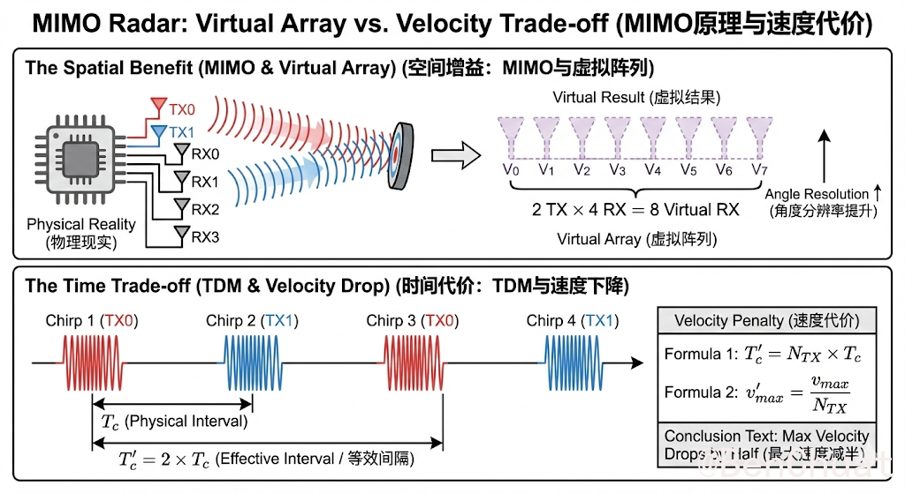

  - **TX 通道（TX0/TX1/TX2）**  
    雷达芯片通常有多路发射天线端口，每路 TX 对应一个物理发射天线或天线子阵。  
    **现实含义**：勾选哪些 TX，就决定“这一条 chirp 到底从哪些天线发射”，进而决定你能不能做角度估计、波束形成等。

  - **MIMO（Multiple-Input Multiple-Output）**  
    用多路 TX 与多路 RX 的组合，形成更多“等效观测通道”。  
    **现实含义**：你能获得更大的等效孔径，从而提升角度分辨率、分离多目标角度、做更稳健的定位/跟踪。

  - **TDM-MIMO（Time-Division Multiplexing MIMO，时分 MIMO）**  
    最常见实现方式：在不同 chirp 上轮流打开不同 TX（例如 TX0→TX1→TX2→TX0…），用“时间复用”来得到多发射通道信息。  
    **现实含义**：角度维度变强了，但代价是每个 TX 自己的“重复采样间隔”变大，速度无模糊范围会变小。

  - **虚拟阵列（Virtual Array）**  
    把不同 TX-RX 组合看作不同的阵元位置，等效形成更多阵元的阵列。  
    **现实含义**：角度分辨率提高、旁瓣更可控，适合 AoA/定位/多目标分离。

  ---

  ### 8.1 TX Enable（TX0/TX1/TX2）怎么影响“你能做什么任务”

  #### 8.1.1 参数如何影响（原理）

  - 只使能 TX0（截图）→ 单 TX：结构最简单，测速模型最直接。
  - 若启用多 TX 做 TDM-MIMO，会让“同一 TX 的等效 chirp 间隔”变大，从而降低最大无模糊速度。粗略可用：

  $$
  T_c' \approx N_\text{TX}T_c,\quad
  v_\text{max}'\approx \frac{\lambda}{4T_c'}=\frac{\lambda}{4N_\text{TX}T_c}
  $$

  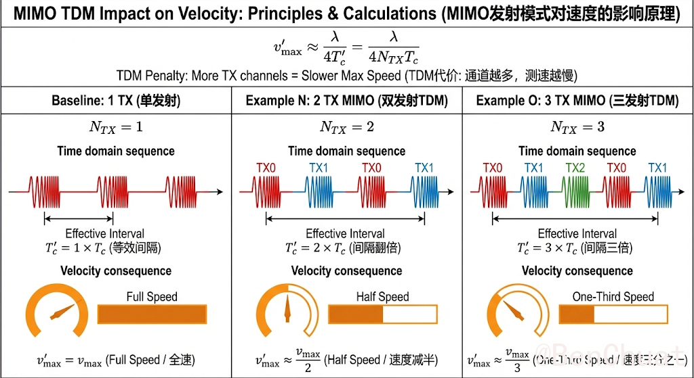

  #### 8.1.2（举例）两组不同的数据

  **示例 N（开启 2TX 的 TDM）**：$N_\text{TX}=2$
  $$
  v_\text{max}'\approx \frac{v_\text{max}}{2}
  $$

  **示例 O（开启 3TX 的 TDM）**：$N_\text{TX}=3$
  $$
  v_\text{max}'\approx \frac{v_\text{max}}{3}
  $$
  （换来角度维度/虚拟阵列的收益，但速度无模糊范围变小）

  ### 8.2 应用场景

  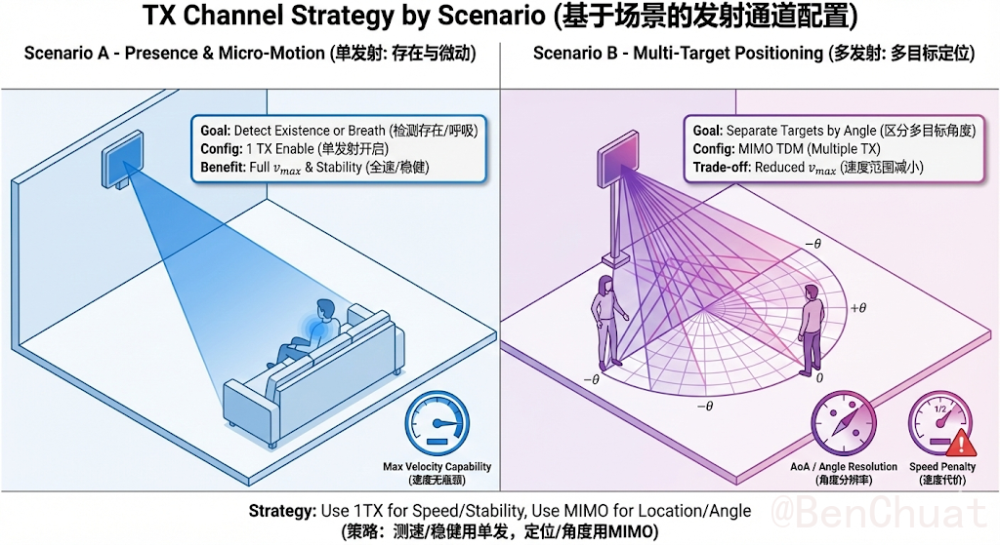

  - **只做测距/微动/存在**：单 TX 往往足够且更稳健。
  - **需要角度/AoA（定位/多目标分离）**：启用多 TX/MIMO，但要重新评估 $v_\text{max}$ 与帧时序预算。

