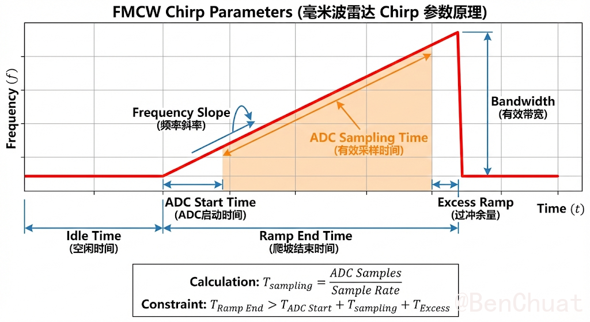
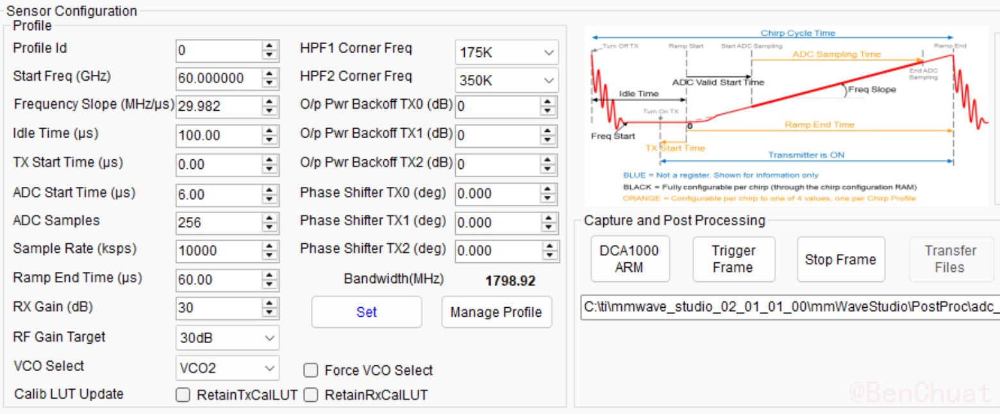
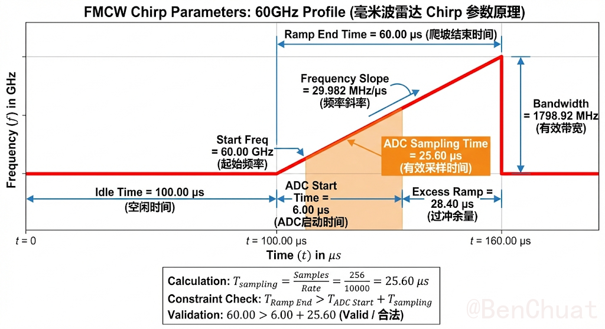
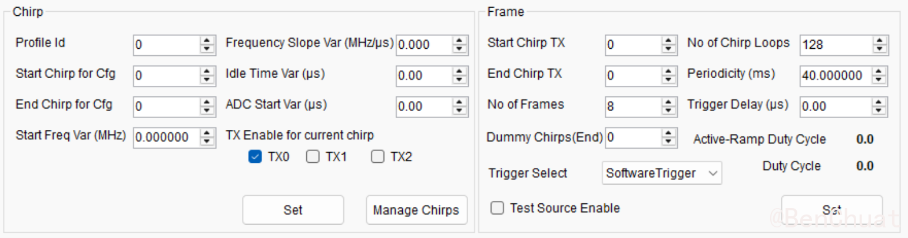
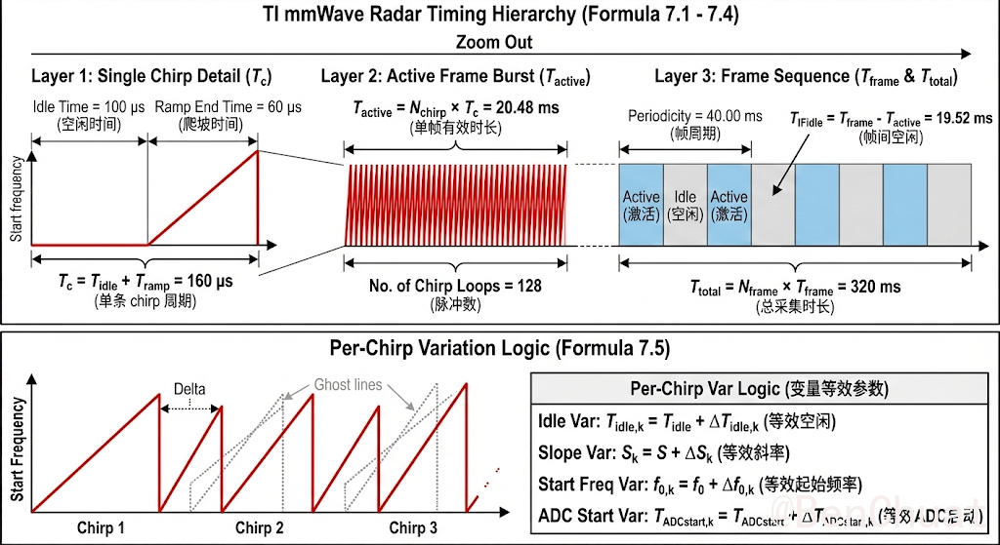
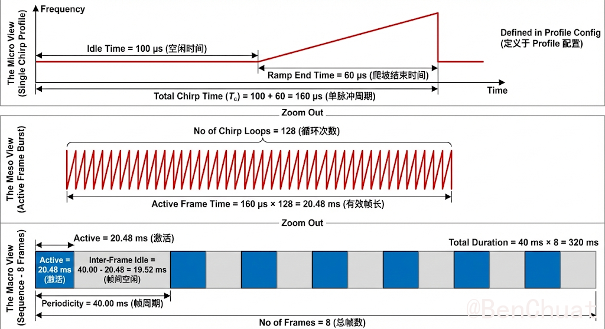

+++
title = "破译雷达的“心跳”：TI 毫米波雷达原理与 mmWave Studio 配置全指南"
date = "2026-01-26T15:27:05.942973+08:00"
lang = "zh-cn"
draft = false
slug = "20260125185117"
categories = []
tags = []
featured = false
summary = ""
+++

# 破译雷达的“心跳”：TI 毫米波雷达原理与 mmWave Studio 配置全指南

对于许多初次接触毫米波雷达的工程师来说，打开 TI mmWave Studio 的 **Sensor Config** 界面往往是一个令人头大的时刻。满屏的参数输入框——Start Freq、Slope、Idle Time、ADC Samples……填错一个数字，配置可能就报错，或者雷达根本看不见目标。

本文将基于 TI 官方文档，探究配置 Chirp 参数。

---

# Profile页

## 1. 参数含义

### 1.1 频率相关参数（对应时频斜坡图的纵轴 Frequency）

- **Start Freq (GHz)**：chirp 起始频率 $f_0$。在时频斜坡图中是红线开始上升前的频率基准；在 mmWave Studio Profile 页中对应 “Start Freq (GHz)”。
- **Frequency Slope (MHz/µs)**：扫频斜率 $S=\frac{df}{dt}$。在时频斜坡图中体现为红色斜线的“倾斜程度”；在 Profile 页对应 “Frequency Slope (MHz/µs)”。
- **Bandwidth (MHz)**：有效扫频带宽 $B$。在时频斜坡图中是右侧蓝色竖箭头“Bandwidth”；在 Profile 页中为只读显示 “Bandwidth (MHz)”（由 $S$ 与 Ramp End Time 计算得到）。

### 1.2 时间相关参数（对应时频斜坡图的横轴 Time）
- **Idle Time (µs)**：空闲时间 $T_{\text{idle}}$。在时频斜坡图中是 ramp 开始前的 “Idle Time”；在 Profile 页对应 “Idle Time (µs)”。
- **Ramp End Time (µs)**：ramp 总时长 $T_{\text{ramp}}$。在时频斜坡图中为 “Ramp End Time”；在 Profile 页对应 “Ramp End Time (µs)”。
- **ADC Start Time (µs)**：ADC 启动延迟 $T_{\text{ADCstart}}$。从 ramp 开始算起，延迟多久才进入有效采样；在时频斜坡图中为 “ADC Start Time”；在 Profile 页对应 “ADC Start Time (µs)”。
- **ADC Sampling Time（有效采样时间）**：$T_{\text{sampling}}$。在时频斜坡图中对应橙色阴影区域 “ADC Sampling Time”；它由 Profile 页中的 ADC Samples 与 Sample Rate 决定。
- **Excess Ramp（过冲/余量）**：$T_{\text{excess}}$。在时频斜坡图中为 ramp 尾部 “Excess Ramp”；通常用于预留模拟链路/PLL 稳定与边界裕量（Profile 页不一定单独给出该值）。

### 1.3 采样相关参数（决定 ADC Sampling Time）
- **ADC Samples**：每条 chirp 采样点数 $N_s$。Profile 页对应 “ADC Samples”。
- **Sample Rate (ksps)**：采样率 $F_s$。Profile 页对应 “Sample Rate (ksps)”；其单位 ksps（千样本/秒），例如 10000 ksps = 10 Msps。

---

## 2. 原理与公式

### 2.1 FMCW 线性调频 chirp（时频斜坡红线模型）
chirp 的瞬时频率可写为：
$$
f(t)=f_0 + S t,\quad 0\le t\le T_{\text{ramp}}
$$

### 2.2 带宽（时频斜坡图的 Bandwidth 蓝箭头）
带宽由斜率与 ramp 时长决定：
$$
B = S\,T_{\text{ramp}}
$$

### 2.3 有效采样时间（时频斜坡图的 ADC Sampling Time 橙色区域）
有效采样时间由采样点数与采样率决定：
$$
T_{\text{sampling}}=\frac{N_s}{F_s}
$$

### 2.4 距离与拍频的基本映射（理解“采样率/斜率影响量程”）
目标距离 $R$ 对应往返时延：
$$
\tau=\frac{2R}{c}
$$
静止目标拍频近似：
$$
f_b\approx S\tau=\frac{2SR}{c}
$$
因此距离与拍频映射：
$$
R\approx \frac{c}{2S}f_b
$$

---

## 3. 参数之间的联系、运算关系、约束

### 3.1 Bandwidth 的计算关系（Profile 页的 Bandwidth 来自时频斜坡）
由时频斜坡图可直接读出：带宽是 ramp 期间频率变化量，因此：
$$
B = S\,T_{\text{ramp}}
$$
例如若 $S=29.982\,\text{MHz}/\mu s$ 且 $T_{\text{ramp}}=60\,\mu s$，则：
$$
B = 29.982\times 60 = 1798.92\,\text{MHz}
$$
这与 Profile 页显示的 1798.92 MHz 一致。

### 3.2 ADC Sampling Time 的计算关系（橙色阴影来自 ADC Samples 与 Sample Rate）
有效采样时间对应橙色阴影长度：
$$
T_{\text{sampling}}=\frac{N_s}{F_s}
$$
若 $N_s=256$ 且 $F_s=10\,\text{Msps}$，则：
$$
T_{\text{sampling}}=\frac{256}{10\times10^6}=25.6\,\mu s
$$

### 3.3 采样窗必须落在 ramp 内（图中黑框 Constraint）
时频斜坡图给出的约束为：
$$
T_{\text{ramp}} > T_{\text{ADCstart}} + T_{\text{sampling}} + T_{\text{excess}}
$$
其中 $T_{\text{ADCstart}}$ 对应 Profile 页的 ADC Start Time；$T_{\text{sampling}}$ 由 ADC Samples 与 Sample Rate 计算；$T_{\text{excess}}$ 对应图中 Excess Ramp。

### 3.4 量程与“采样率—斜率”的关系（与时频斜坡/采样相关）
采样率决定最大无混叠拍频（Nyquist 近似）：
$$
f_{b,\max}\approx \frac{F_s}{2}
$$
映射为最大无混叠距离（静止目标近似）：
$$
R_{\max}\approx \frac{c}{2S}\cdot\frac{F_s}{2}=\frac{cF_s}{4S}
$$
因此：
- 在 $F_s$ 不变时，提高 $S$（更陡斜率）会降低 $R_{\max}$；
- 在 $S$ 不变时，提高 $F_s$ 会提高 $R_{\max}$。

### 3.5 Idle Time 与 chirp 周期（与时频斜坡图 Idle Time 相关）
单条 chirp 周期常用近似：
$$
T_c \approx T_{\text{idle}} + T_{\text{ramp}}
$$
$T_{\text{idle}}$ 对应 Profile 页 Idle Time；$T_{\text{ramp}}$ 对应 Ramp End Time。

---

## 4. 对雷达实际操作与现象的影响（从“你会看到什么”角度）

### 4.1 调整 $S$ 与 $T_{\text{ramp}}$（影响 Bandwidth）
- $B$ 增大（$S$ 更大或 $T_{\text{ramp}}$ 更长）意味着更高的距离分辨能力（更小的 $\Delta R$）。距离分辨率由：
$$
\Delta R=\frac{c}{2B}
$$
- 但 $S$ 变大也会使同一距离对应更高拍频 $f_b=\frac{2SR}{c}$，如果 $F_s$ 或 IF 带宽不足，可能引发距离折叠或假峰。

### 4.2 调整 ADC Start Time（影响采到的是“稳定段”还是“瞬态段”）
- $T_{\text{ADCstart}}$ 设得过小：ADC 可能采到 ramp 初期的瞬态（PLL 未完全稳定、泄漏/DC 较强），表现为距离谱杂散增多、底噪抬升、相位不稳。
- $T_{\text{ADCstart}}$ 设得过大：会挤压有效采样窗，甚至违反约束：
$$
T_{\text{ramp}} > T_{\text{ADCstart}} + T_{\text{sampling}} + T_{\text{excess}}
$$

### 4.3 调整 ADC Samples 与 Sample Rate（影响采样窗长度与量程）
- 增大 $N_s$ 会增加 $T_{\text{sampling}}$，提升频率分辨率/距离谱细腻度，但更容易触碰时序约束。
- 增大 $F_s$ 会减少单点采样间隔并提高可采的 $f_{b,\max}$，从而提高 $R_{\max}$：
$$
R_{\max}\approx \frac{cF_s}{4S}
$$
代价是数据率更高、存储/传输压力更大。

### 4.4 调整 Idle Time（影响 chirp 周期与系统节奏）
- 增大 $T_{\text{idle}}$ 会增加 chirp 周期：
$$
T_c \approx T_{\text{idle}} + T_{\text{ramp}}
$$
chirp 更“稀疏”，系统更容易稳定，但对多普勒/速度相关性能通常不利（PRF 降低）。

---

## 5. 不同应用的简略配置建议（仅针对图中这些参数）

### 5.1 近距离人体微动/喉部（0–1 m，重相位稳定与近距可见）
- 选择适中的带宽 $B$（够用即可），避免一味拉大 $S$ 导致拍频过高。
- 让 $T_{\text{ADCstart}}$ 略大于瞬态持续时间（通常几微秒量级），确保采样落在稳定的线性 ramp 段。
- 用约束检查窗口：
$$
T_{\text{ramp}} > T_{\text{ADCstart}} + \frac{N_s}{F_s} + T_{\text{excess}}
$$
保证有余量，避免贴边采样。

### 5.2 中远距离测距（>10 m，重最大量程）
- 在满足带宽需求的前提下，优先保证 $R_{\max}$：
$$
R_{\max}\approx \frac{cF_s}{4S}
$$
常见做法是：降低 $S$ 或提高 $F_s$（或两者结合）。
- 仍需满足采样窗约束，避免 $N_s$ 过大导致采样越界。

### 5.3 速度/手势（重 chirp 周期与 PRF）
- 缩短 $T_c$（减小 $T_{\text{idle}}$ 或减小 $T_{\text{ramp}}$）以提高 chirp 重复频率。
- 带宽 $B$ 可取中等；优先把时序做稳、窗口约束做对。

### 5.4 通用折中（先定分辨率，再定量程与时序）
1) 由目标距离分辨率定带宽：
$$
B=\frac{c}{2\Delta R}
$$
2) 由 $B=S T_{\text{ramp}}$ 选择可行的 $S$ 与 $T_{\text{ramp}}$ 组合；
3) 检查采样窗约束：
$$
T_{\text{ramp}} > T_{\text{ADCstart}} + \frac{N_s}{F_s} + T_{\text{excess}}
$$
4) 检查量程是否满足：
$$
R_{\max}\approx \frac{cF_s}{4S}
$$

---

## 6. Chirp和Frame

### 6.1 Profile（决定单条 chirp 的基本时序）
- **Idle Time (µs)**：空闲时间 $T_\text{idle}$。单条 chirp 中扫频开始前（或两条 chirp 之间）的空档时间。上图给出示例 $T_\text{idle}=100\,\mu s$。
- **Ramp End Time (µs)**：扫频持续时间 $T_\text{ramp}$。上图给出示例 $T_\text{ramp}=60\,\mu s$。

> 上一节出单条 chirp 的总时长（Total Chirp Time）：$T_c = T_\text{idle}+T_\text{ramp}$。

### 6.2 Chirp 配置（下图左侧 Chirp 区域）
- **Profile Id**：该 chirp 采用哪个 Profile（决定 $T_\text{idle}, T_\text{ramp}$ 等）。
- **Start Chirp for Cfg / End Chirp for Cfg**：将一组 chirp 配置应用到 chirp 索引范围（常用于一次配置多个 chirp）。
- **Frequency Slope Var (MHz/µs)**：在当前 chirp 上叠加斜率微调 $\Delta S$（为 0 表示不变）。
- **Idle Time Var (µs)**：在当前 chirp 上叠加空闲时间微调 $\Delta T_\text{idle}$（为 0 表示不变）。
- **ADC Start Var (µs)**：在当前 chirp 上叠加 ADC 启动延迟微调 $\Delta T_\text{ADCstart}$（为 0 表示不变）。
- **Start Freq Var (MHz)**：在当前 chirp 上叠加起始频率微调 $\Delta f_0$（为 0 表示不变）。
- **TX Enable for current chirp (TX0/TX1/TX2)**：本 chirp 使能哪些发射天线（图中示例只勾选 TX0）。

> 注：这些 “Var” 的意义是 **在 Profile 基础上做 per-chirp 的微调**。若 Var 全为 0，则一帧内每条 chirp 完全一致。

### 6.3 Frame 配置（下图右侧 Frame 区域）
- **Start Chirp TX / End Chirp TX**：一帧中实际发射的 chirp 索引范围（从第几条 chirp 发到第几条 chirp）。
- **No of Chirp Loops**：每帧内 chirp 重复次数 $N_\text{chirp}$（上图示例为 128）。
- **Periodicity (ms)**：帧周期 $T_\text{frame}$（上图示例为 40 ms）。
- **No of Frames**：总帧数 $N_\text{frame}$（上图示例为 8）。
- **Trigger Delay (µs)**：触发延迟 $T_\text{trig}$（从触发到帧开始的延迟，上图示例为 0）。
- **Dummy Chirps (End)**：每帧末尾追加的 dummy chirp 数（常用于链路稳定/热平衡/丢弃过渡数据等；示例为 0）。
- **Trigger Select**：触发方式（示例为 SoftwareTrigger）。

---

## 7. 原理与公式

### 7.1 单条 chirp 周期（Micro 层）
$$
T_c = T_\text{idle} + T_\text{ramp}
$$

### 7.2 单帧有效时长（Meso 层：Active Frame Time）
若每帧发射 $N_\text{chirp}$ 条 chirp，则帧内“激活发射”的有效时长（不含帧间空闲）为：
$$
T_\text{active} = N_\text{chirp}\,T_c
$$

### 7.3 帧间空闲（Inter-Frame Idle）与帧周期（Macro 层）
帧周期由 Periodicity 给定为 $T_\text{frame}$，则帧间空闲时间为：
$$
T_\text{IFidle} = T_\text{frame} - T_\text{active}
$$

### 7.4 总采集时长（Total Duration）
总帧数为 $N_\text{frame}$，则总时长为：
$$
T_\text{total} = N_\text{frame}\,T_\text{frame}
$$

### 7.5 可选：若启用 per-chirp 变量（Var）后的“等效参数”
对第 $k$ 条 chirp（在 frame 内），若 Var 非 0，则：
- 等效空闲时间：$T_{\text{idle},k} = T_\text{idle} + \Delta T_{\text{idle},k}$
- 等效斜率：$S_k = S + \Delta S_k$
- 等效起始频率：$f_{0,k} = f_0 + \Delta f_{0,k}$
- 等效 ADC 启动：$T_{\text{ADCstart},k} = T_\text{ADCstart} + \Delta T_{\text{ADCstart},k}$

---

## 8. 参数之间的联系、运算关系、约束

### 8.1 从 Profile 到图中 Micro：$T_c$ 的直接计算
上图示例给出：
- $T_\text{idle}=100\,\mu s$
- $T_\text{ramp}=60\,\mu s$

因此单条 chirp 周期：
$$
T_c = 100\,\mu s + 60\,\mu s = 160\,\mu s
$$
这对应上图第一行的 “Total Chirp Time ($T_c$) = 160 µs”。

### 8.2 从 Micro 到 Meso：Active Frame Time 的计算
上图示例 $N_\text{chirp}=128$（下图 “No of Chirp Loops = 128”）：
$$
T_\text{active} = 128 \times 160\,\mu s = 20480\,\mu s = 20.48\,ms
$$
对应上图第二行 “Active Frame Time = 20.48 ms”。

### 8.3 从 Meso 到 Macro：帧间空闲与 Periodicity 的约束
上图示例 $T_\text{frame}=40\,ms$（下图 “Periodicity = 40 ms”）：
$$
T_\text{IFidle} = 40\,ms - 20.48\,ms = 19.52\,ms
$$
对应上图第三行 “Inter-Frame Idle = 19.52 ms”。

**关键约束（必须满足）**：为了让帧周期有效，必须有
$$
T_\text{frame} \ge T_\text{active}
$$
否则 $T_\text{IFidle}<0$，帧会“排不下”，配置不可用或导致实际行为与预期不一致。

### 8.4 总时长与帧数

上图示例 $N_\text{frame}=8$（下图 “No of Frames = 8”）：
$$
T_\text{total} = 8 \times 40\,ms = 320\,ms
$$
对应上图右上角 “Total Duration = 40 ms × 8 = 320 ms”。

### 8.5 Start/End Chirp TX 与 No of Chirp Loops 的关系（帧内 chirp 组织）
- 设帧内实际发射 chirp 索引范围为 $[i_\text{start}, i_\text{end}]$。
- 若该范围包含的 chirp 数为 $N_\text{set}=i_\text{end}-i_\text{start}+1$，则 No of Chirp Loops 表示对这组 chirp 重复的 loop 次数。
- 当 $i_\text{start}=i_\text{end}$（下图示例 Start=0, End=0）时，表示每次 loop 只发 **同一条 chirp**，重复 $N_\text{chirp}=128$ 次形成帧内 burst。

---

## 9. 参数调整速查指南：想改变什么就调什么

在实际配置雷达时，你可能会遇到这样的需求："我想让雷达测得更远"、"我想让速度测得更准"、"我想让距离分得更细"等等。下面用最直白的方式告诉你：**想改变什么性能，就调哪个参数**。

### 9.1 常见需求与对应参数调整

#### 想让雷达测得更远？

**调这两个参数：**
- **增大 Sample Rate（采样率 $F_s$）**：比如从 10 Msps 调到 15 Msps，雷达能看到的距离会更远。
- **减小 Frequency Slope（斜率 $S$）**：比如从 30 MHz/µs 降到 20 MHz/µs，也能测得更远。

**原理**：最大量程公式 $R_\max \approx \frac{cF_s}{4S}$，所以增大 $F_s$ 或减小 $S$ 都能让 $R_\max$ 变大。

**注意**：采样率不能超过设备限制（AWR2243 最高 20 MHz，AWR1243 最高 15 MHz）。

#### 想让距离分得更细（能区分两个很近的目标）？

**调这两个参数：**
- **增大 Frequency Slope（斜率 $S$）**：让扫频更陡。
- **增大 Ramp End Time（扫频时长 $T_\text{ramp}$）**：让扫频时间更长。

**原理**：距离分辨率 $\Delta R = \frac{c}{2B}$，而带宽 $B = S \cdot T_\text{ramp}$。所以增大 $S$ 或 $T_\text{ramp}$ 都能增大带宽 $B$，从而让距离分辨率更细。

**举例**：如果原来能区分 10 cm 的两个目标，增大带宽后可能能区分 5 cm 的目标。

#### 想让速度测得更准（速度精度更高）？

**调这两个参数：**
- **增大 No of Chirp Loops（每帧 chirp 数 $N_\text{chirp}$）**：比如从 64 调到 128，速度精度会提高。
- **增大 Periodicity（帧周期 $T_\text{frame}$）**：比如从 40 ms 调到 80 ms，也能提高速度精度。

**原理**：速度精度取决于观测时间，chirp 数越多、帧周期越长，观测时间越长，速度精度越高。

#### 想测更快的速度？

**调这个参数：**
- **减小 Idle Time（空闲时间 $T_\text{idle}$）** 或 **减小 Ramp End Time（扫频时长 $T_\text{ramp}$）**，让 chirp 周期 $T_c$ 变小。

**原理**：最大可测速度 $v_\max = \frac{\lambda}{4T_c}$，chirp 周期越小，能测的速度上限越高。

**注意**：chirp 周期不能太小，否则采样窗可能放不下（见下面的约束）。

#### 想让距离谱更细腻（FFT 后点数更多）？

**调这个参数：**
- **增大 ADC Samples（采样点数 $N_s$）**：比如从 256 调到 512，距离谱会更细腻。

**原理**：采样点数越多，FFT 后的频率分辨率越高，距离谱的点数也越多。

**注意**：点数增大会让采样时间变长，需要检查采样窗是否还能放得下（见约束检查）。

#### 想让采样更稳定（减少杂散和噪声）？

**调这个参数：**
- **增大 ADC Start Time（ADC 启动延迟 $T_\text{ADCstart}$）**：比如从 6 µs 调到 10 µs，避开扫频初期的瞬态。

**原理**：扫频刚开始时，PLL 可能还没完全稳定，这时候采样会有杂散。延迟一点再采样，数据更干净。

**注意**：延迟不能太大，否则采样窗可能放不下（见约束检查）。

### 9.2 约束检查：这些"红线"不能碰

配置参数时，mmWave Studio 会检查一些约束。如果违反约束，配置会报错或者雷达工作不正常。下面用最直白的方式说明这些约束：

#### 约束 1：采样窗必须放在扫频稳定段内（最重要！）

**人话**：你设置的采样时间（橙色区域）必须完全落在扫频的稳定段内，不能越界。

**检查公式**：
$$
T_\text{ramp} > T_\text{ADCstart} + \frac{N_s}{F_s} + T_\text{excess}
$$

**怎么看**：在 mmWave Studio 的时频斜坡图中，橙色采样窗必须完全在红色扫频线（ramp）的稳定段内，不能超出 ramp 的边界。

**如果违反会怎样**：
- mmWave Studio 会报错，不让你配置。
- 或者配置了但采样数据无效，距离谱出现异常。

**怎么改**：
- 增大 `Ramp End Time`（让 ramp 更长，有更多空间放采样窗）
- 或减小 `ADC Samples`（让采样时间更短）
- 或增大 `ADC Start Time`（延迟采样，但注意别延迟太多）

#### 约束 2：采样率不能超过设备限制

**人话**：你设置的采样率不能超过雷达芯片能支持的最大值。

**限制值**：
- AWR2243：最高 20 MHz
- AWR1243：最高 15 MHz

**如果违反会怎样**：mmWave Studio 会拒绝配置，或者自动截断到最大值。

**怎么改**：把 `Sample Rate` 调小，或者换一个支持更高采样率的芯片。

#### 约束 3：帧周期必须大于所有 chirp 的总时长

**人话**：你设置的帧周期（Periodicity）必须足够长，能装下所有 chirp。

**检查公式**：
$$
T_\text{frame} \ge N_\text{chirp} \times T_c
$$

其中 $T_c = T_\text{idle} + T_\text{ramp}$ 是单条 chirp 的周期。

**怎么看**：在 mmWave Studio 的 Frame 配置页面，查看 "Inter-Frame Idle" 这个值。如果它是负数或接近 0，说明帧周期太短了。

**如果违反会怎样**：
- 帧无法完整执行
- 触发失败
- 数据错乱

**怎么改**：
- 增大 `Periodicity`（让帧周期更长）
- 或减小 `No of Chirp Loops`（减少每帧的 chirp 数）
- 或减小单条 chirp 的周期（减小 `Idle Time` 或 `Ramp End Time`）

#### 约束 4：带宽不能超过设备最大带宽

**人话**：你计算的带宽（$B = S \times T_\text{ramp}$）不能超过芯片支持的最大值（通常是 4 GHz）。

**如果违反会怎样**：mmWave Studio 会拒绝配置或自动截断。

**怎么改**：减小 `Frequency Slope` 或 `Ramp End Time`，让带宽降下来。

### 9.3 配置流程：从需求到参数

假设你现在要配置一个雷达，按以下步骤来：

1. **确定需求**：比如"我要测 50 米远的目标，距离精度 10 cm，速度精度 0.1 m/s"。

2. **算带宽**：根据距离精度需求，算带宽 $B = \frac{c}{2\Delta R} = \frac{3\times10^8}{2\times0.1} = 1500$ MHz。

3. **选斜率和扫频时长**：根据带宽 $B = S \times T_\text{ramp}$，选一个合理的组合。比如 $S = 25$ MHz/µs，$T_\text{ramp} = 60$ µs，得到 $B = 1500$ MHz。

4. **算采样率**：根据最大量程需求，由 $R_\max \approx \frac{cF_s}{4S}$ 反推 $F_s$。比如要测 50 米，$F_s \approx \frac{4SR_\max}{c} = \frac{4\times25\times10^6\times50}{3\times10^8} \approx 16.7$ Msps。选一个接近的值，比如 15 Msps。

5. **选采样点数**：根据距离谱细腻度需求选 $N_s$，比如 256 或 512。

6. **检查采样窗约束**：确保 $T_\text{ramp} > T_\text{ADCstart} + \frac{N_s}{F_s} + T_\text{excess}$。如果不够，调整参数。

7. **选帧参数**：根据速度精度需求，选 `No of Chirp Loops` 和 `Periodicity`。

8. **检查帧周期约束**：确保 `Periodicity` $\ge$ `No of Chirp Loops` $\times$ $T_c$。

9. **在 mmWave Studio 中验证**：填好参数后，查看时频斜坡图和时序图，确认没有警告和错误。

### 9.4 常见问题快速诊断

- **距离谱出现假峰或折叠** → 采样率或斜率太大了，超出了 IF 带宽限制。减小 `Sample Rate` 或 `Frequency Slope`。

- **采样窗报错** → 采样时间太长，放不下了。增大 `Ramp End Time` 或减小 `ADC Samples`。

- **帧触发失败** → 帧周期太短，装不下所有 chirp。增大 `Periodicity` 或减小 `No of Chirp Loops`。

- **距离分辨率不够** → 带宽太小。增大 `Frequency Slope` 或 `Ramp End Time`，但注意同时检查量程是否还满足。

- **测不到远距离目标** → 采样率太小或斜率太大。增大 `Sample Rate` 或减小 `Frequency Slope`。

---

## 参考文献

1. Texas Instruments. *Programming Chirp Parameters in TI Radar Devices* (Rev. A). Application Report SWRA553A, May 2017–Revised February 2020. [Online]. Available: https://www.ti.com.cn/cn/lit/an/swra553a/swra553a.pdf

==！本内容仅个人学习中的记录，不敢保证正确性，请大佬轻喷，指点==