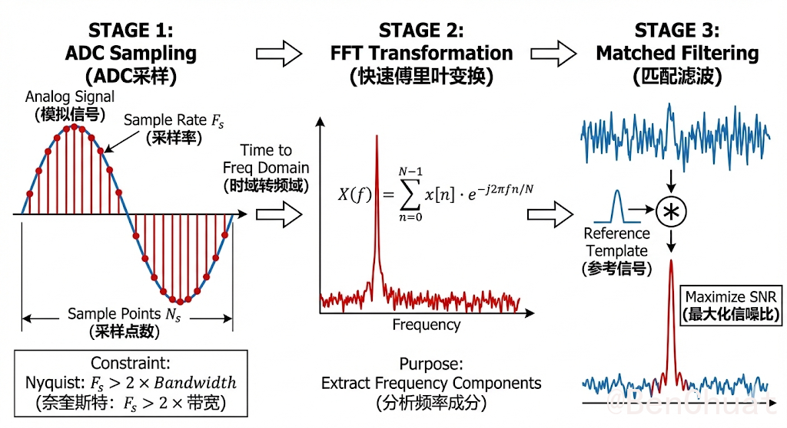
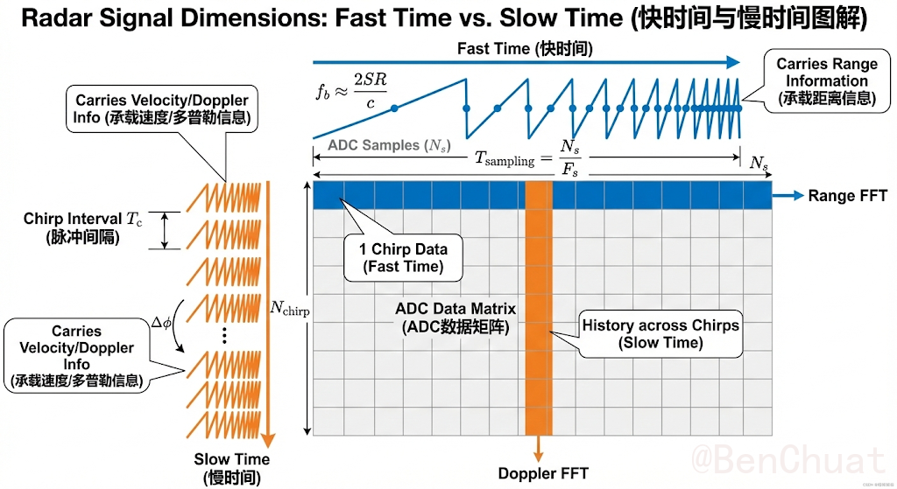
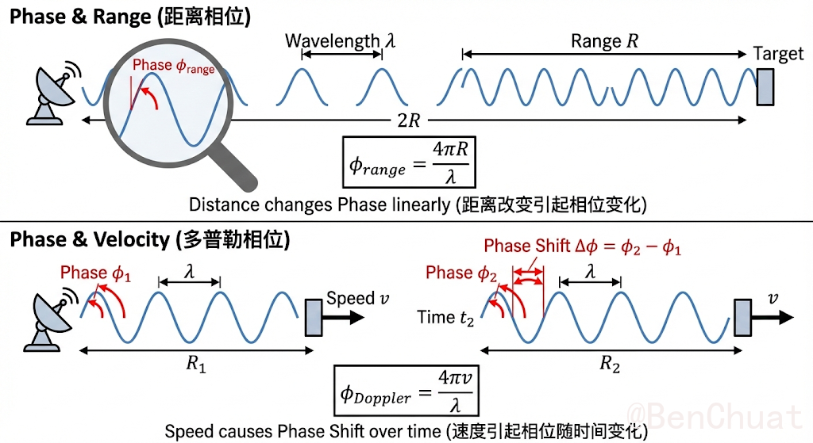
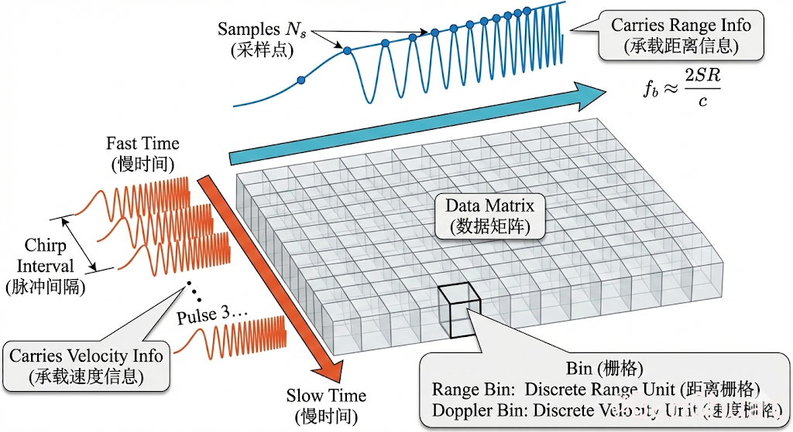
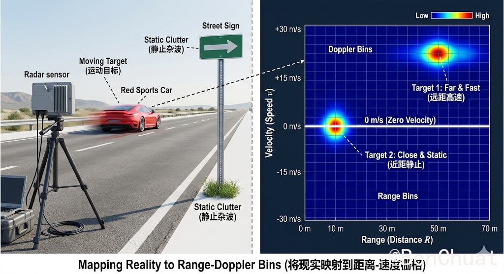

+++
title = "雷达信号处理名词解释"
date = "2026-01-26T15:25:42.053713+08:00"
lang = "zh-cn"
draft = false
slug = "20260126151331"
categories = []
tags = []
featured = false
summary = ""
+++

# 雷达信号处理名词解释

==！本内容仅个人学习中的记录，不敢保证正确性，请大佬轻喷，指点==

雷达信号处理是毫米波雷达系统的核心部分，它的任务是将雷达接收到的原始信号转化为有效的信息。本文将对雷达信号处理中常见的名词进行解释，并按逻辑顺序依次展开。包括快时间、慢时间、FFT、匹配滤波、信噪比、ADC采样、相位、Range Bin 等关键概念。

信号处理的一般流程：

**阶段1（ADC 采样）**将接收的连续时间模拟回波 $x(t)$ 以采样率 $F_s$ 离散化为序列 $x[n]=x(nT_s)$（其中 $T_s=1/F_s$，采样点数为 $N_s$）。为了避免频谱混叠，采样必须满足奈奎斯特条件，即对信号的有效带宽 $B$ 需有 $F_s>2B$，从而保证离散序列对原始信号信息的可恢复性与后续频域分析的有效性。

**阶段2（FFT 变换）**对离散序列执行离散傅里叶变换（通常用 FFT 高效实现），得到频域表示 $X[k]=\sum_{n=0}^{N-1}x[n]e^{-j2\pi kn/N}$。其目的在于将时域信号的能量分解到不同频率分量上，使得信号中的主导频率成分（例如雷达中的拍频或多普勒频移）在频谱上表现为突出峰值，从而便于频率参数估计、峰值检测与后续的距离/速度映射。频域视角还能直观揭示噪声底与谱泄漏等现象，为滤波与检测算法设计提供依据。

**阶段3（匹配滤波）**利用已知参考模板（发射信号或其等效模型）对接收信号进行相关/卷积处理，即对模板 $s(t)$ 的共轭时间反转形式 $h(t)=s^*(T-t)$ 进行滤波（离散情形为 $y[n]=\sum_m x[m]h[n-m]$），以在加性白噪声假设下实现输出信噪比（SNR）最优。匹配滤波会将与模板形状一致的回波能量在某一时刻（或某一延迟/频率单元）“相干叠加”形成尖锐峰值，同时抑制非匹配噪声与干扰，因此常用作脉冲压缩、目标检测与到达时延估计的核心步骤。

## 1. 快时间与慢时间

### 快时间（Fast Time）
快时间通常指的是**一条 chirp 内部的采样时间**。在 FMCW 雷达中，信号从发射到接收形成的回波会随时间延迟，并且这些回波的时延直接与目标距离相关。因此，快时间主要承载“距离”信息。

**公式：**
$$
f_b \approx \frac{2 S R}{c}
$$
其中，$f_b$ 是拍频，$S$ 是频率斜率，$R$ 是目标的距离，$c$ 是光速。  
快时间的长度通常由采样点数 $N_s$ 和采样率 $F_s$ 决定：
$$
T_{\text{sampling}} = \frac{N_s}{F_s}
$$

### 慢时间（Slow Time）

慢时间指的是多个 chirp 之间的时间间隔。雷达会对多个 chirp 的回波做连续采样，从而得到目标的运动信息。慢时间主要承载“速度”或“微动”信息，目标的速度引起的多普勒效应会在慢时间内表现出来。

**快时间（行内采样）→ 做 Range FFT → 距离信息**

**慢时间（chirp 序列）→ 做 Doppler FFT → 速度/多普勒信息**

中间的 ADC 矩阵就是把原始数据按“行=chirp 内采样、列=chirp 序列”组织起来，方便做 **2D FFT（Range-Doppler）**。

---

## 2. ADC采样

**什么是 ADC 采样？**
ADC（模拟到数字转换器）将模拟信号转换为数字信号。在雷达中，接收到的回波信号是模拟信号，必须经过 ADC 采样后才能处理。

**采样率和采样点数：**
- **采样率** $F_s$：决定每秒采样多少次。采样率越高，可以捕捉更细致的信号变化，获得更高的分辨率。
- **采样点数** $N_s$：一条 chirp 中采样的点数。更多的采样点数可以提供更高的频率分辨率。

采样定理要求采样率 $F_s$ 必须大于信号带宽的两倍，以避免混叠现象。

---

## 3. 快速傅里叶变换（FFT）

### 什么是 FFT？
FFT（快速傅里叶变换）是一种算法，用于将时域信号转换为频域信号。在雷达信号处理中，FFT 主要用于**从时域转换到频域**，从而分析信号的频率成分。

**应用：**
- **距离 FFT（Range FFT）**：对快时间上的采样进行 FFT，得到目标的距离信息。
- **多普勒 FFT（Doppler FFT）**：对慢时间上的信号进行 FFT，分析目标的速度信息。

### FFT 公式：
对信号进行离散傅里叶变换（DFT）：
$$
X(f) = \sum_{n=0}^{N-1} x[n] \cdot e^{-j2\pi fn/N}
$$
其中，$X(f)$ 是频域信号，$x[n]$ 是时域信号，$N$ 是采样点数，$f$ 是频率。

---

## 4. 匹配滤波（Matched Filtering）

**什么是匹配滤波？**
匹配滤波是一种优化滤波技术，用于提高信号的信噪比（SNR）。在雷达信号处理中，匹配滤波将接收到的信号与一个已知的参考信号进行卷积，从而提高目标信号的检测能力，特别是在噪声环境中。

**应用：**
- 在 FMCW 雷达中，匹配滤波能够有效地去除噪声，提高回波信号的质量。
- 匹配滤波器的设计通常是与发射信号的形状一致。

## 5. 信噪比（SNR）

**什么是信噪比？**
信噪比（SNR，Signal-to-Noise Ratio）是指信号强度与噪声强度的比值。较高的 SNR 意味着信号在噪声中更加突出，反之，则信号难以从噪声中分辨。

**现实含义：**
- **高 SNR**：目标容易识别，雷达能准确测量目标的距离、速度等信息。
- **低 SNR**：信号淹没在噪声中，目标可能被误检测或无法检测。

SNR 影响雷达的检测能力，通常通过匹配滤波、增益控制等方式提升。

---

## 6. 相位（Phase）

**什么是相位？**
相位是波的一个重要属性，指的是波形的周期性变化位置。在雷达中，目标的相位信息随着距离和速度的变化而变化。

**在雷达信号中的作用：**
- **距离相位**：目标的距离会影响接收信号的相位，通常与拍频直接相关。
- **速度相位（多普勒相位）**：目标的速度会引起相位的线性变化，这个变化与目标的径向速度成正比。

**公式：**
- **距离相位**：由目标的距离变化引起的相位变化。
$$
\phi_{\text{range}} = \frac{4\pi R}{\lambda}
$$
其中，$R$ 是目标的距离，$\lambda$ 是信号的波长。

- **速度相位**：由目标的径向速度引起的相位变化。
$$
\phi_{\text{Doppler}} = \frac{4\pi v}{\lambda}
$$
其中，$v$ 是目标的速度。

---

## 7. Range Bin 和 Doppler Bin

### Range Bin（距离栅格）
**什么是 Range Bin？**
Range Bin 是在距离谱中将频率分配到的每一个离散单位，每一个 bin 代表一个特定的距离区间。

- 通过 FFT，我们可以得到多个 range bin，每个 bin 对应一个目标的距离。
  
### Doppler Bin（速度栅格）
**什么是 Doppler Bin？**
Doppler Bin 是在多普勒谱中将频率分配到的离散单位，每个 bin 对应一个特定的速度区间。

- Doppler Bin 是通过对慢时间做 FFT 得到的，它们帮助我们区分目标的速度。

---

## 8. 距离-速度图（Range-Doppler Map）

**什么是距离-速度图？**
距离-速度图是通过对快时间做 Range FFT 和对慢时间做 Doppler FFT 得到的二维图。该图的横轴表示目标的距离，纵轴表示目标的速度。

- **应用：** 通过分析距离-速度图，可以识别多个目标、跟踪目标的运动轨迹。

==！本内容仅个人学习中的记录，不敢保证正确性，请大佬轻喷，指点==