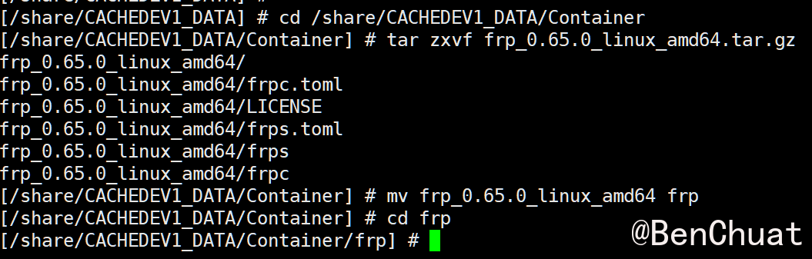
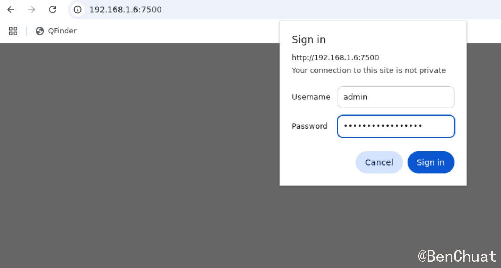
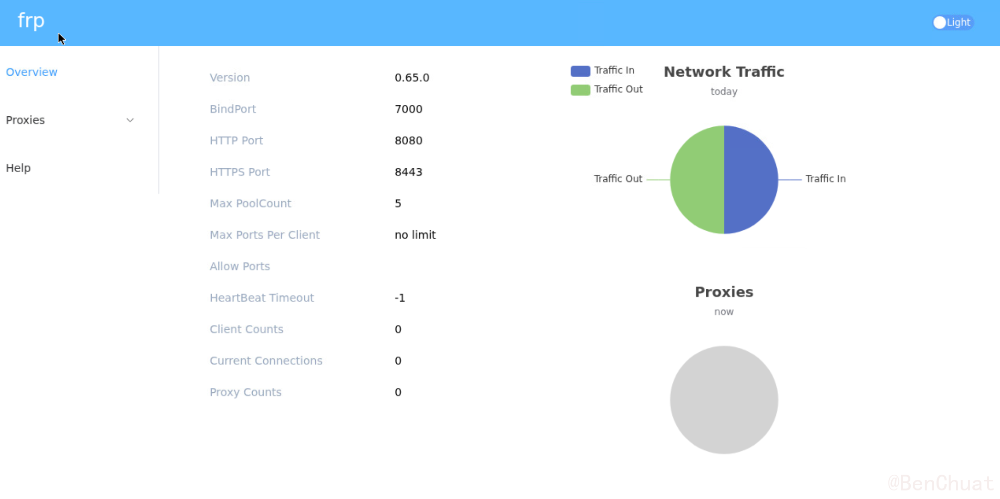
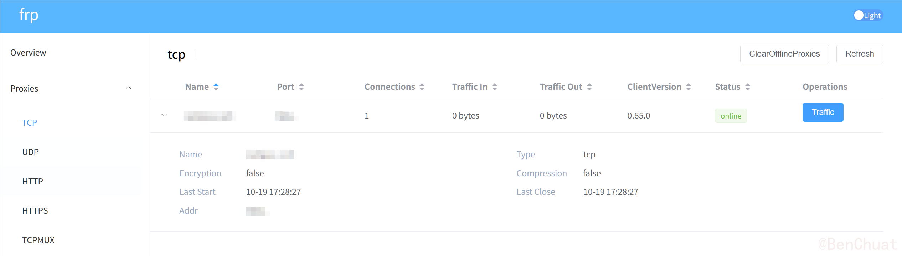

+++
title = "FRP 内网穿透全攻略：让校园服务器轻松被公网访问（基于 NAS 中转）"
date = "2025-11-05T10:44:58.432051+08:00"
lang = "zh-cn"
draft = "false"
slug = "frp"
categories = []
tags = [ "内网穿透", "FRP", "NAS", "" ]
featured = "false"
summary = ""
+++
# FRP 内网穿透全攻略：让校园服务器轻松被公网访问（基于 NAS 中转）

> **作者：BenChuat**
> **适用场景：**校园服务器、内网主机、科研服务器无法被外网访问
> **关键词：**FRP、内网穿透、反向代理、NAS、SSH、HTTP、端口转发

------

##  一、前言：校园服务器访问难题

很多学校或企业的服务器部署在**局域网**中，虽然能访问外网，但**外网无法主动访问它**，即便开了 SSH 服务，也被 NAT 和校园防火墙阻断。

常见痛点：

* 无法直接 SSH 登录校园机；
* 无法外网访问校园机上的 Web 服务；
* 校园机只能主动访问外网，无法反向连接；
* 多端口服务（数据库、Flask、JupyterLab）不好统一管理。

**解决方案？**
 使用你公网可访问的 NAS（如 QNAP、群晖、阿里云主机）作为中转，搭建一套 **FRP（Fast Reverse Proxy）** 内网穿透系统，让外网安全访问你的校园服务器！

------

## 二、什么是 FRP？

**FRP（Fast Reverse Proxy）** 是一个由 [@fatedier](https://github.com/fatedier) 开发的高性能反向代理工具。
 项目地址：https://github.com/fatedier/frp

它支持：

* **TCP / UDP / HTTP / HTTPS** 协议；
* **自定义域名映射**；
* **多客户端连接管理**；
* **仪表盘实时监控**；
* **加密与鉴权机制**。

> 简单来说，校园机主动与 NAS 建立连接，外部访问 NAS 即可转发流量到校园机。

------

## 三、部署架构说明

| 角色         | 机器                   | 功能     | 软件组件          |
| ------------ | ---------------------- | -------- | ----------------- |
| 校园机       | Ubuntu Server          | 被访问方 | `frpc`（客户端）  |
| NAS/公网主机 | QNAP / 群晖 / 云服务器 | 中转服务 | `frps`（服务端）  |
| 外网电脑     | 任意设备               | 访问入口 | SSH / HTTP 客户端 |

------

## 四、部署步骤详解

### 4.1在 NAS（公网机）上安装 frps

#### 下载 FRP 最新版本

```bash
VERSION="0.65.0"
wget https://github.com/fatedier/frp/releases/download/v${VERSION}/frp_${VERSION}_linux_amd64.tar.gz
tar zxvf frp_${VERSION}_linux_amd64.tar.gz
cd frp_${VERSION}_linux_amd64
```

> 👉 官方发布页：https://github.com/fatedier/frp/releases

网络问题无法直接命令行下载的可以手动下载，再上传到nas/公网服务器。


 在 NAS 上解压并部署：

```
cd /share/CACHEDEV1_DATA/Container
tar zxvf frp_0.65.0_linux_amd64.tar.gz
mv frp_0.65.0_linux_amd64 frp
cd frp

mv frp_0.65.0_linux_amd64/* ./

```



#### 创建配置文件 `/opt/frp/frps.toml`

```toml
cat > /share/CACHEDEV1_DATA/Container/frp/frps.toml <<'EOF'
[common]
bind_port = 6666                  # frpc 连接端口，请确保路由/防火墙允许访问
token = "mySecureToken_REPLACE_ME"  # <- 强烈建议替换成复杂随机字符串

# Dashboard（仪表盘）
dashboard_addr = "0.0.0.0"
dashboard_port = 7500
dashboard_user = "admin"
dashboard_pwd = "StrongPassword123"

# 可选：HTTP/HTTPS 虚拟主机端口（如果打算做域名 vhost）
vhost_http_port = 8080
vhost_https_port = 8443

# 日志设置
log_file = "./frps.log"
log_level = "info"
log_max_days = 3

# 可选：仅允许特定远程端口范围
# allow_ports = "6000-7000"
EOF

```

==记住你的`token = "mySecureToken_REPLACE_ME"`,后面有用==

#### 启动服务端

```bash
./frps -c ./frps.toml

# 用 daemon_mgr 后台托管了 frps
/sbin/daemon_mgr frps start "/share/CACHEDEV1_DATA/Container/frp/frps -c /share/CACHEDEV1_DATA/Container/frp/frps.toml"

```

或注册为 systemd 服务：

```bash
sudo vi /etc/systemd/system/frps.service
[Unit]
Description=FRP Server
After=network.target

[Service]
ExecStart=/opt/frp/frps -c /opt/frp/frps.toml
Restart=always
RestartSec=5

[Install]
WantedBy=multi-user.target
```

启动：

```bash
sudo systemctl daemon-reload
sudo systemctl enable --now frps
sudo systemctl status frps
```

#### 打开防火墙端口

确保你的 NAS 或路由器放行以下端口：

* 7000（FRP控制连接）
* 7500（Dashboard）
* 8080 / 8443（HTTP/HTTPS 转发）

现在访问：http://[你的nas/服务器ip]:7500，输入 `admin / StrongPassword123` 查看仪表盘。





------

### 4.2在校园机（Ubuntu）安装 frpc

#### 先做环境检测（非常重要）

在校园机上执行以下命令，确认系统版本与架构（决定要下载哪个二进制）：

```
# 系统版本
lsb_release -a || cat /etc/os-release

# 内核和 CPU 架构（x86_64 => linux_amd64）
uname -a
uname -m
```

输出示例：

* `Ubuntu 22.04`
* `x86_64` → 选择 `frp_*_linux_amd64.tar.gz`
* `aarch64` 或 `arm64` → 选择 `frp_*_linux_arm64.tar.gz`（若你的校园机是 ARM）

**离线方式（如果校园机不能连 GitHub）**

在可以访问外网的电脑上下载：

> [FRP 0.65.0 Release 下载页](https://github.com/fatedier/frp/releases/tag/v0.65.0)

下载：

* `frp_0.65.0_linux_amd64.tar.gz`（x86_64）
* 或 `frp_0.65.0_linux_arm64.tar.gz`（ARM）

然后上传到校园机：

```
scp frp_0.65.0_linux_amd64.tar.gz user@example.com
cd /home/user
tar -xzf frp_0.65.0_linux_amd64.tar.gz
sudo mv frp_0.65.0_linux_amd64 /opt/frp-client
cd /opt/frp-client
chmod +x frpc
```

#### 创建配置文件 `/opt/frp/frpc.toml`

```toml

serverAddr = "nas.benchuat.cn"
serverPort = 6666

[auth]
method = "token"
token = "mySecureToken"  # ⚠️ 请替换成和 NAS 一致的 token


[transport]
protocol = "tcp"

[log]
level = "info"
maxDays = 3
to = "frpc.log"

[[proxies]]
name = "campus_ssh"
type = "tcp"
localIP = "127.0.0.1"
localPort = 22
remotePort = 6000

# 如果你想再映射一个 web 服务，可以取消注释以下部分
# [[proxies]]
# name = "campus_web"
# type = "http"
# localIP = "127.0.0.1"
# localPort = 8081
# customDomains = ["web.example.cn"]

```

忘记token了？在nas/公网服务器上cat一下：

```bash
cat /share/CACHEDEV1_DATA/Container/frp/frps.toml
```

注意：

| 场景                       | NAS bindPort | 校园 serverPort | 校园 remotePort | 外网访问端口 | 说明           |
| -------------------------- | ------------ | --------------- | --------------- | ------------ | -------------- |
| **标准配置（推荐）**       | 7000         | 7000            | 6000            | :6000        | 最通用         |
| **改端口版**               | 6666         | 6666            | 6000            | :6000        | OK             |
| **多服务版（多个客户端）** | 6666         | 6666            | 6000~6010       | :600x        | OK             |
| **错误配置（冲突）**       | 6666         | 7000            | 6666            | ❌            | 冲突、无法启动 |

`bindPort`/`serverPort` 是“命令通道”；==（要一样！）==

`remotePort` 是“你想让外部能访问的那个服务端口”。

#### 启动 frpc

```bash
./frpc -c ./frpc.toml
```

测试：

```bash
ssh -p <remotePort> monalisa@example.cn
```

连接成功后，在控制面板能看到这条链接




---

## 五、开机自启（systemd 持久化）

创建 systemd 服务：

```bash
sudo vi /etc/systemd/system/frpc.service
[Unit]
Description=FRP Client
After=network-online.target

[Service]
User=monalisa
ExecStart=/opt/frp/frpc -c /opt/frp/frpc.toml
Restart=always
RestartSec=10

[Install]
WantedBy=multi-user.target
```

启动并验证：

```bash
sudo systemctl daemon-reload
sudo systemctl enable --now frpc
sudo systemctl status frpc
```

---

* 官方项目主页：https://github.com/fatedier/frp
* 官方文档（含配置样例）：https://gofrp.org/docs/
* 社区讨论区：https://github.com/fatedier/frp/discussions
* 最新 Release 下载页：https://github.com/fatedier/frp/releases

