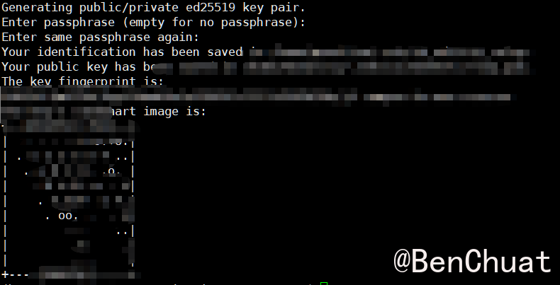
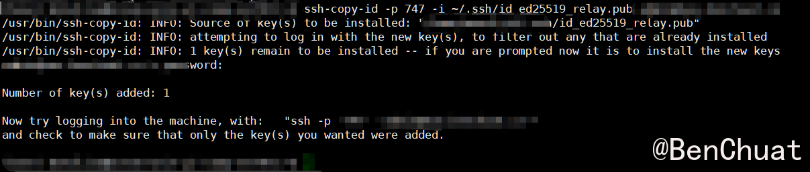
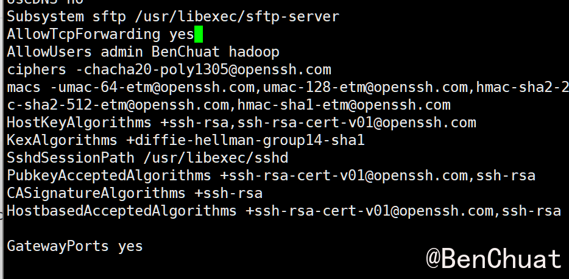
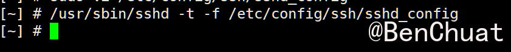
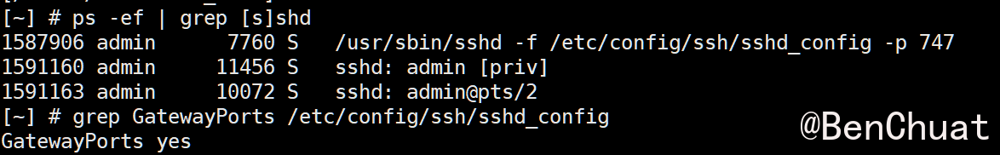

+++
title = "SSH反向隧道-用公网NAS做中转访问校园内Ubuntu服务器"
date = "2025-11-05T10:48:12.948831+08:00"
lang = "zh-cn"
draft = false
slug = "ssh反向隧道-用公网nas做中转访问校园内ubuntu服务器"
categories = []
tags = [ "NAS", "内网穿透", "SSH",]
featured = false
summary = ""
+++

# 用公网 NAS 做中转访问校园内 Ubuntu 服务器（完整实战指南）

> 场景：你在学校有一台只能主动访问外网、外网无法直接访问的 Ubuntu 服务器（内网/校园网环境）。你还有一台可以被公网访问的 NAS（例如 QNAP/群晖 或 任意有公网 IP / 端口映射的机器）。目标是：通过 NAS 做“中转/跳板”，从外网安全、稳定地远程 SSH 登录校园服务器。
>  本文以 **SSH 反向隧道（Reverse SSH Tunnel）** 为主线，逐步讲解场景分析、原理、完整命令、持久化、自动重连、故障排查与安全实践，适合直接照着部署。

------

# 一、场景与需求分析

**问题**

* 校园服务器（简称 *campus*）在学校内网，受防火墙/NAT 限制，外网不能直接连接到它；但 *campus* 可以主动访问外网（例如能够连接到 NAS）。
* 你有一台公网可达的 NAS（简称 *nas*），可通过域名或公网 IP 访问。

**目标**

* 通过 NAS，把 campus 的 SSH 暴露到公网端口（例如 `nas.example.com:6000`），从外网可以安全登录 campus。

**优点（为什么选 SSH 反向隧道）**

* 步骤简单、依赖少（只需 SSH）。
* 对单个端口极其稳定（适合 SSH 远程登录）。
* 可与 autossh + systemd 配合实现自动重连、开机自启。

**局限**

* 单一隧道原生只对某些端口（这里是 SSH）方便；若需 Web/数据库/多端口，推荐后续使用 FRP、WireGuard/Tailscale 等方案（本文结尾简要提到）。

------

# 二、原理简介（为什么可行？）

**SSH 反向隧道（`ssh -R`）**：
 当 campus 发起到 nas 的 SSH 连接并带上 `-R remote_port:localhost:local_port`，会在 NAS 上打开一个 `remote_port`，并将到该端口的连接通过 SSH 通道转发回 campus 的 `localhost:local_port`。
 也就是说，外网访问 `nas:remote_port` 实际上等价于访问 `campus:local_port`。

关键点：

* `GatewayPorts`（NAS 的 sshd 配置）决定远程转发监听地址（仅 localhost 或 0.0.0.0）。
* 使用 `autossh`/systemd 能自动保持和重连隧道。
* 可在 NAS 做防火墙、账号限制等安全加固。

------

# 三、部署前准备（先决条件）

1. **campus（校园 Ubuntu 服务器）**
	* 能主动访问 `nas`（DNS 或 IP）。
	* 安装了 `ssh` 客户端（默认有）。
2. **nas（公网机器 / NAS）**
	* 可被外网访问（公网 IP 或做了端口映射、域名解析）。
	* 能登录（SSH）并有权限编辑 `/etc/ssh/sshd_config`（或能向运维申请 `GatewayPorts yes`）。
	* 防火墙/路由器允许你在 NAS 上打开目标端口（例如 6000）。
3. **账号与占位符说明（替换为你自己的）**
	* NAS 地址或域名：`nas.example.com`
	* NAS 登录用户：`nasuser`（用于接收 tunnel）
	* 校园服务器用户：`campususer`
	* 想在 NAS 上监听的端口：`6000`（可改为任意未占用端口）

------

# 四、一步步实战（复制粘贴可执行）

下面的命令都以 `nas.example.com`、`nasuser`、`campususer`、端口 `6000` 为示例，请根据实际替换。

------

## 1) 在 campus 上生成 SSH 密钥（用于免密连接）

```bash
# 在 campus 上
ssh-keygen -t ed25519 -C "campus-to-nas-reverse" -f ~/.ssh/id_ed25519_relay
# 回车两次（不设置 passphrase 更方便 autossh，但更安全的做法是设置 passphrase 并启用 ssh-agent）
```

生成后会有：

* 私钥：`~/.ssh/id_ed25519_relay`
* 公钥：`~/.ssh/id_ed25519_relay.pub`



------

## 2) 把公钥复制到 NAS（使 campus 能免密码登录 NAS）

**方法 A（推荐，如果 NAS 可用密码登录）**

- -p 22 ： 是端口
- nasuser@nas.example.com ：公网服务器的用户名和地址

```bash
ssh-copy-id -p 22 -i ~/.ssh/id_ed25519_relay.pub nasuser@nas.example.com
```



**方法 B（手动）**

```bash
cat ~/.ssh/id_ed25519_relay.pub | ssh nasuser@nas.example.com 'mkdir -p ~/.ssh && umask 077 && cat >> ~/.ssh/authorized_keys'
```

---

登录 NAS，确认 `~/.ssh/authorized_keys` 权限为 600，`~/.ssh` 权限为 700。

在 NAS 上执行以下命令（假设你现在是登录到 `admin` 用户）：

```
cd ~
chmod 700 ~/.ssh
chmod 600 ~/.ssh/authorized_keys
```

确认：

```
ls -ld ~/.ssh ~/.ssh/authorized_keys
```

输出应类似：

```
drwx------ 2 admin admin 4096 Oct 19  ~/.ssh
-rw------- 1 admin admin  400 Oct 19  ~/.ssh/authorized_keys
```

> 这一步是为了让 sshd 信任该密钥；如果权限过宽，会直接拒绝登录（表现为输入密码依旧要求验证）。

------

## 3) 在 NAS 上启用 `GatewayPorts`（允许把远程端口绑定到 0.0.0.0）

在 NAS 上（QNAP）执行：

```
sudo vi /etc/config/ssh/sshd_config
```

找到或添加一行：

```
GatewayPorts yes
```

然后找到这一行：

```
AllowTcpForwarding no
```

把它改为：

```
AllowTcpForwarding yes
```

保存后退出。



> 💡 如果文件里有 `#GatewayPorts no`，请取消注释并改成 `yes`。

验证配置文件语法

```
/usr/sbin/sshd -t -f /etc/config/ssh/sshd_config
```

如果没有任何输出，表示语法 OK。


保存后重启 SSH 服务（不同 NAS 平台命令不同）：

**杀掉旧进程并重新启动：**

```
killall sshd
/usr/sbin/sshd -f /etc/config/ssh/sshd_config -p 747
```

**验证是否生效：**

```
ps -ef | grep [s]shd
grep GatewayPorts /etc/config/ssh/sshd_config
```



------

## 4) 单次测试：在 campus 发起临时反向隧道

在 campus 上执行（用于测试）：

```bash
ssh -p 8209 -i ~/.ssh/id_ed25519_relay -N -R 0.0.0.0:8209:localhost:22 admin@nas.benchuat.cn
ssh -p 747 -i ~/.ssh/id_ed25519_relay -N -R 0.0.0.0:3209:localhost:22 admin@nas.benchuat.cn
```

解释：

* `-i` 指定私钥；
* `-p` 远程nas的ssh端口；
* `-N` 不执行远程命令；
* `-R 0.0.0.0:8209:localhost:22` 表示在 NAS 的所有网卡上监听 8209，并把流量转发回 campus 的 22。

**在外网测试（另一台外网机器）**：

```bash
ssh -p 8209 campususer@nas.example.com
```

如果一切正常，你将直接登录到 campus。恭喜！

------

## 5) 持久化（推荐）：用 `autossh` + systemd 开机自启自动重连

**安装 autossh（在 campus）**

```bash
sudo apt update
sudo apt install -y autossh
```

**新建并编辑文件：**

```
sudo vi /etc/systemd/system/reverse-ssh-tunnel.service
```

粘贴以下内容：

```
[Unit]
Description=Reverse SSH tunnel to NAS (autossh)
After=network-online.target
Wants=network-online.target

[Service]
# 请把 monalisa 换成你校园机当前用户名
User=monalisa
Environment="AUTOSSH_GATETIME=0"

ExecStart=/usr/bin/autossh -M 0 -N \
  -o "ServerAliveInterval=30" \
  -o "ServerAliveCountMax=3" \
  -o "ExitOnForwardFailure=yes" \
  -i /home/monalisa/.ssh/id_ed25519_relay \
  -R 0.0.0.0:8209:localhost:22 admin@nas.benchuat.cn -p 747

Restart=always
RestartSec=10

[Install]
WantedBy=multi-user.target
```

**参数解释**

| 参数                     | 含义                           |
| ------------------------ | ------------------------------ |
| `AUTOSSH_GATETIME=0`     | 避免短暂断开后退出             |
| `-M 0`                   | 禁用监控端口，直接使用心跳机制 |
| `ServerAliveInterval=30` | 每 30 秒发送一次心跳           |
| `ServerAliveCountMax=3`  | 连续 3 次无响应则重连          |
| `Restart=always`         | 掉线或网络断开后自动重启       |
| `RestartSec=10`          | 10 秒后重试                    |

* 把 `User=campususer`、私钥路径 `/home/campususer/.ssh/id_ed25519_relay`、`nasuser@nas.example.com`、及 `0.0.0.0:6000` 替换为你的实际值。
* `AUTOSSH_GATETIME=0` 可避免首次短断连导致 autossh 退出。

**启用并启动服务**

```bash
sudo systemctl daemon-reload
sudo systemctl enable --now reverse-ssh-tunnel.service
sudo systemctl status reverse-ssh-tunnel.service
# 实时查看日志
sudo journalctl -u reverse-ssh-tunnel.service -f
```

若输出显示 `Established` 或无错误，说明隧道已经自动建立并会在断线后重连。

---

# 延展：如果你想穿透更多服务（简单介绍）

* **FRP（功能强）**：支持 HTTP、TCP、UDP、多端口、域名映射等。NAS 可运行 `frps`（服务端），campus 运行 `frpc`（客户端）。适合多端口或将多个内网服务暴露到公网。
* **WireGuard / Tailscale（VPN 风格）**：把 campus 和 NAS（或你的工作机）放在同一个虚拟网络里，像局域网一样访问任意端口。Tailscale 更易用，适合需要长期、安全地访问多种服务的场景。
* **ngrok / cloudflared（第三方服务）**：使用第三方隧道（可能受限于免费版流量/时间），不推荐用于敏感服务。

------

# 九、简要流程

** campus：生成 key 并复制到 NAS**

```bash
ssh-keygen -t ed25519 -C "campus-to-nas-reverse" -f ~/.ssh/id_ed25519_relay
ssh-copy-id -i ~/.ssh/id_ed25519_relay.pub nasuser@nas.example.com
```

** campus：临时启动反向隧道（测试）**

```bash
ssh -i ~/.ssh/id_ed25519_relay -N -R 0.0.0.0:6000:localhost:22 nasuser@nas.example.com
```

** campus：安装 autossh 并创建 systemd（持久化）**

```bash
sudo apt update
sudo apt install -y autossh

# 编辑 /etc/systemd/system/reverse-ssh-tunnel.service，内容如下（替换为真实值）：
# [Unit] ... (见上文完整 systemd 单元)
# 保存后：
sudo systemctl daemon-reload
sudo systemctl enable --now reverse-ssh-tunnel.service
sudo systemctl status reverse-ssh-tunnel.service
sudo journalctl -u reverse-ssh-tunnel.service -f
```

** NAS：确保 sshd_config 中 GatewayPorts yes 并 restart sshd**

```bash
# 编辑 /etc/ssh/sshd_config，设置 GatewayPorts yes
sudo systemctl restart sshd
# 或 NAS 平台的相应重启命令
```

** 外网登录 campus**

```bash
ssh -p 6000 campususer@nas.example.com
```

------

