+++
title = "从 0 到上线：用 Hugo + blowfish主题打造一个超快、超美、超自由的个人博客"
date = "2025-11-05T10:42:44.754422+08:00"
lang = "zh-cn"
draft = "false"
slug = "hugo-and-blowfish"
categories = []
tags = [ "Blowfish", "Hugo", "博客搭建", "" ]
featured = "false"
summary = ""
+++
# 从 0 到上线：用 Hugo + blowfish主题打造一个超快、超美、超自由的个人博客

一生中要做三件浪漫的小事：
 养一只猫，爱一个对的人，还有建一个自己的博客。

自建博客这件事，最好玩的是：
 你说它长什么样，它就长什么样；你敲出哪行字，它就传遍全世界。

今天带你用 **Hugo + GitHub Pages**，打造一套又快又优雅的博客系统。
 免费、无广告、安全、可玩性极高。

------

## 为什么选 Hugo？

静态博客生成器百家争鸣，Hugo 为何加冕？

| 特性           | 描述                               |
| -------------- | ---------------------------------- |
| 速度逆天       | 几毫秒就能生成整个站点，V8都追不上 |
| 纯静态部署     | 免费托管，CDN 静态缓存，更安       |
| Markdown + Git | 适合程序员的浪漫                   |

## 安装Hugo

若未安装scoop则先安装：

1.打开PowerShell 

2.解除执行策略限制

复制执行：

```
Set-ExecutionPolicy RemoteSigned -Scope CurrentUser
```

输入 `A` 继续

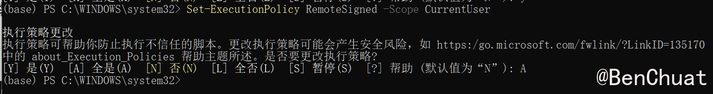

3.安装 Scoop

```
Invoke-WebRequest -useb get.scoop.sh | Invoke-Expression
```

或者备用镜像（更快更稳）：

```
irm get.scoop.sh | iex
```

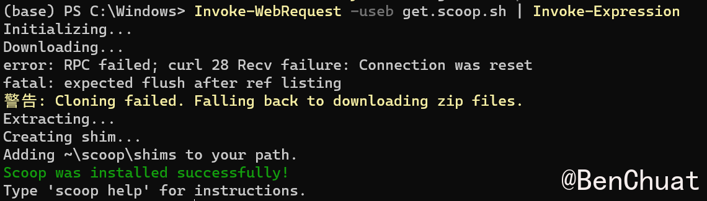

4.验证 Scoop

```
scoop --version
```

如果能显示版本则安装成功
 如果提示未找到命令，请重启 PowerShell

---

**安装hugo预编译**

```powershell
scoop install hugo-extended git
hugo version
```

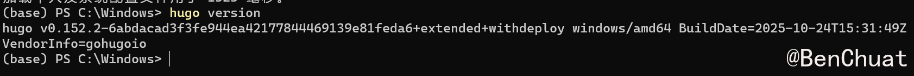

如果scoop安装不行就去github下载zip [nunocoracao/blowfish：Hugo 的个人网站和博客主题](https://github.com/nunocoracao/blowfish),然后把解压出来的hugo.exe放到 `C:\Windows\System32`

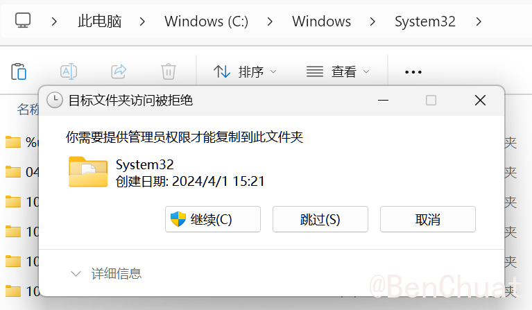

### Linux

```bash
sudo apt update
sudo apt install hugo git -y
hugo version
```

确保显示 **extended**
 不然 CSS 会炸。

------

## 添加Blowfish

### 安装Blowfish-Tools

添加 Blowfish，我使用Blowfish-Tools,更多方法可以参考官方文档-> [安装和配置 · Blowfish](https://blowfish.page/zh-cn/docs/installation/)

打开cmd或powershell安装

```bash
npm i -g blowfish-tools
```

安装完可以运行以下命令打开工具：
```bash
blowfish-tools
```

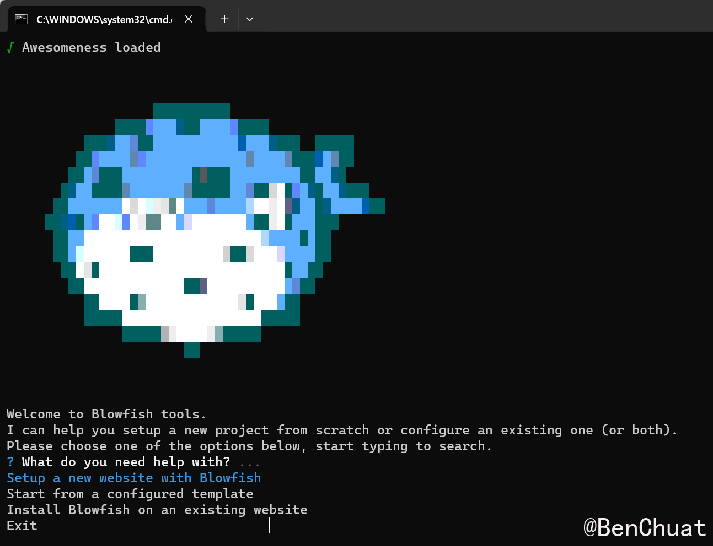

或运行下面命令，快速创建一个项目：

```bash
blowfish-tools new mynewsite
```

打开了工具后，==方向键选择选项，回车键确认。==

现在选择`setup a new website with blowfish`，回车；

然后输入你要创建项目的路径（或写一个名字，会在目录下新建项目文件夹），回车。

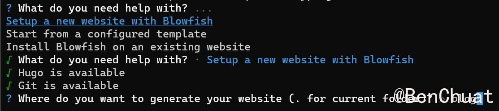

安装完之后就能进入配置菜单
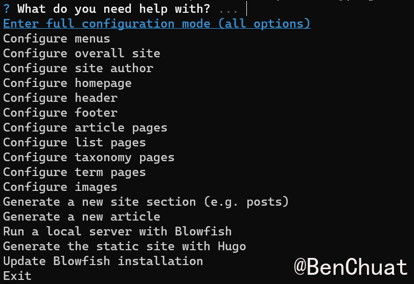

## 配置站点

### 复制配置文件

把`./themes/blowfish/config/_default`下的主题所有配置文件(.toml)，复制到项目目录`./config/_default`下。

* 项目根目录下的 `config/_default` 会**覆盖**主题的默认配置。
* 当 Hugo 找不到对应配置时，会回退读取主题的版本。

后续我就直接在根目录下的 `config/_default` 下修改配置了

```
hugo.toml              ← 总控中心
│
└── config/_default/
    ├── languages.en.toml  ← 定义语言结构
    ├── menus.en.toml      ← 定义导航栏
    ├── markup.toml        ← 控制 Markdown 渲染
    ├── module.toml        ← 主题路径定义
    └── params.toml        ← Blowfish 个性配置（最重要）

```

### 手动配置文件

- ### menus.en.toml

```
[[main]]
name = "首页"
pageRef = "/"
weight = 1

[[main]]
name = "归档"
pageRef = "/archives/"
weight = 2

[[main]]
name = "标签"
pageRef = "/tags/"
weight = 3

[[main]]
name = "关于"
pageRef = "/about/"
weight = 4
```

- ### languages.en.toml

```
[zh-cn]
languageName = "中文"
weight = 1

```

- ### languages.en.toml

```
[author]
   name = "MyName"
   image = "profile.jpg"
   headline = "Good Luck"
   bio = "about me" 
```

### 也可以用blowfish-tools进行配置

在站点根目录下cmd，输入blowfish-tools，打开辅助工具

第一次使用建议跑一遍全向导，把必要配置一次写好：

* **Configure overall site**：站点名、语言、搜索、暗色模式
* **Configure site author**：作者名、头像、社交链接
* **Configure menus**：导航栏（首页/归档/标签/关于）
* **Configure homepage**：首页块布局与简介
* **Configure header / footer**：顶部/底部小部件
* **Configure article pages**：目录、阅读时长、代码复制按钮
* 预览：**Run a local server with Blowfish**

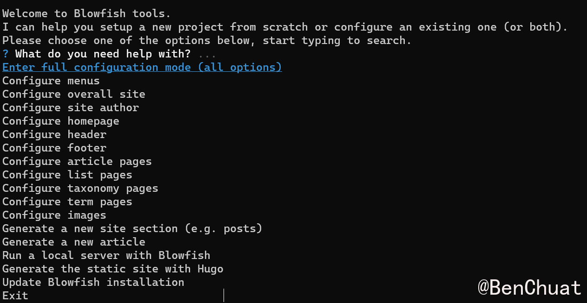

每次保存后都可以再跑一次预览看看效果。

### 配置中英文双站

参考 -> [开启多语言支持 · BenChuat的记录本](https://benchuat.github.io/posts/开启多语言支持/)


### 配置归档页

分别在中英目录`content/zh-cn/archives`、 `content/en/archives`下创建 _index.md，指定使用列表布局，并按年分组显示摘要。

**content/zh-cn/archives/_index.md**

```markdown
---

title: "归档"

date: 2025-01-01

layout: "list"

groupByYear: true

showSummary: true

---
```

**content/en/archives/_index.md**

```
---

title: "Archive"

date: 2025-01-01

layout: "list"

groupByYear: true

showSummary: true

---
```

说明：

* Blowfish 的 layouts/_default/list.html 会根据该 section 下的页面自动渲染为文章列表，groupByYear 配合主题参数可按年份分组。

* 你无需在 archives 目录中放文章，文章应在 content/{lang}/posts/。

### 预览

现在可以在hugo项目目录下输入`hugo server`或通过前面提到的blowfish-tools来启动服务,在本机上预览。


------

## 在GitHub上托管

### 在 GitHub 上创建仓库

打开 GitHub → 点击右上角 “➕ → New repository”
仓库名称填写为：

```
[你的GitHub用户名].github.io
```

例如我叫 `BenChuat`，那仓库名应为：

```
benchuat.github.io
```

仓库设置为 **Public**，勾选 “Add a README file”，点击 **Create repository**。

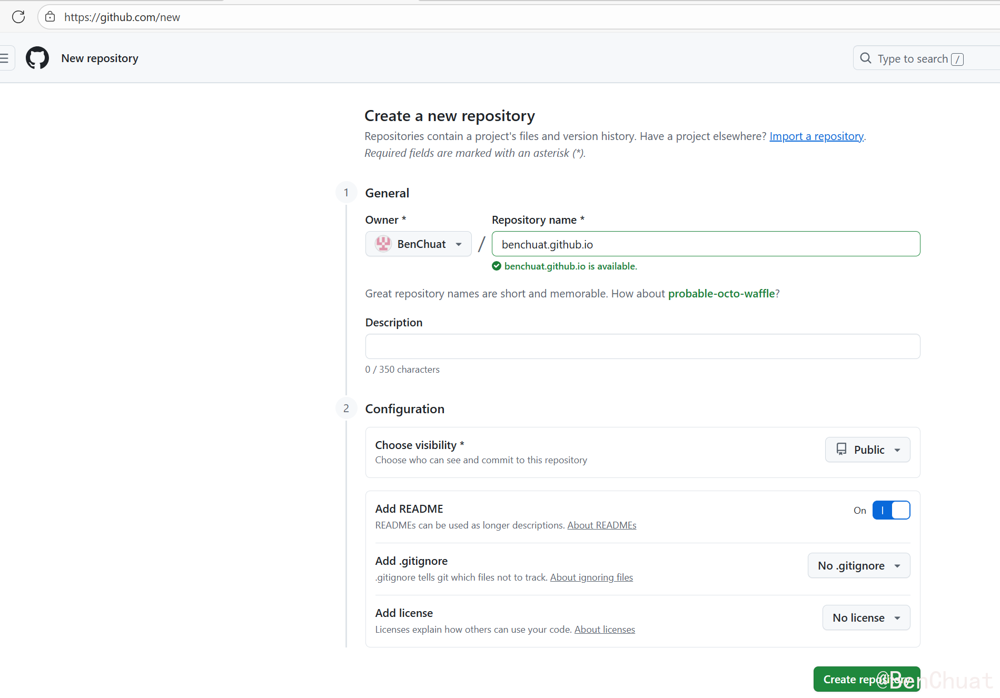

至此，个人网页仓库就创建好了。

------

### 本地初始化 Git 并连接远程仓库

进入 Hugo 博客项目根目录（不是 public 文件夹）：

```bash
cd D:\hugo\blog
git init
git remote add origin https://github.com/benchuat/benchuat.github.io.git
git remote set-url origin https://github.com/benchuat/benchuat.github.io.git
# 如是修改地址则把add改为set-url
# git remote set-url origin https://github.com/newuser/newrepo.git
# 查看远程仓库地址
# git remote -v
git add .
git commit -m "Init Hugo source"
git branch -M main
git push -u origin main
```

这时 GitHub 上就会有你的 **Hugo 源代码**。

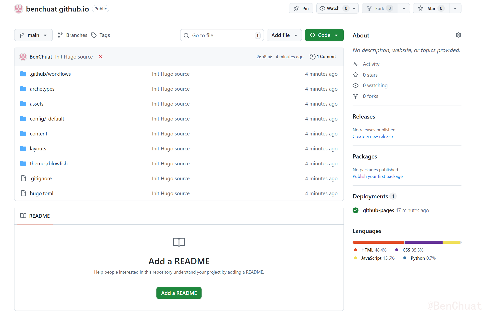

------

### 配置 GitHub Actions 自动部署

这一部分是最核心的：让 GitHub 自动执行 `hugo` 命令，并把生成的静态网页部署到 Pages。

#### 创建 Actions 配置文件

在项目根目录下新建文件夹：

```
.github/workflows/
```

在里面新建一个文件：

```
deploy.yml
```

内容如下：

```yaml
name: Deploy Hugo to GitHub Pages

on:
  push:
    branches: [ main ]

permissions:
  contents: read
  pages: write
  id-token: write

concurrency:
  group: "pages"
  cancel-in-progress: true

jobs:
  build:
    runs-on: ubuntu-latest
    steps:
      - name: Checkout
        uses: actions/checkout@v4
        with:
          submodules: true
          fetch-depth: 0

      - name: Setup Hugo
        uses: peaceiris/actions-hugo@v3
        with:
          hugo-version: '0.152.2'   # 用你本地的版本
          extended: true

      - name: Build
        run: hugo --minify

      # 补齐 *.assets 到 public
      - name: Copy Typora .assets folders into public (fixed with subdir)
        run: |
          set -eu
          shopt -s globstar nullglob

          for md in content/**/*.md; do
            base="${md%.md}"             # content/zh-cn/posts/test-post
            assets="${base}.assets"      # content/zh-cn/posts/test-post.assets
            [ -d "$assets" ] || continue

            rel="${base#content/}"       # zh-cn/posts/test-post
            lang="${rel%%/*}"            # zh-cn or en
            rest="${rel#*/}"             # posts/test-post (或更深的层级)
            name="${rest##*/}"           # test-post
            sectionPath="${rest%/*}"     # posts

            if [ "$lang" = "zh-cn" ]; then
              # 默认语言放根目录：/posts/<name>/<name>.assets
              out="public/${sectionPath}/${name}/${name}.assets"
            else
              # 非默认语言：/en/posts/<name>/<name>.assets
              out="public/${lang}/${sectionPath}/${name}/${name}.assets"
            fi

            mkdir -p "$out"
            cp -R "$assets"/. "$out/"
            echo "Copied: $assets -> $out"
          done

      - name: Upload artifact
        uses: actions/upload-pages-artifact@v3
        with:
          path: ./public

  deploy:
    needs: build
    runs-on: ubuntu-latest
    environment:
      name: github-pages
      url: ${{ steps.deployment.outputs.page_url }}
    steps:
      - id: deployment
        uses: actions/deploy-pages@v4

```

------

#### 在 GitHub 启用 Pages

进入仓库 → 点击上方 **Settings** → 左侧栏选择 **Pages**。
 在 **Build and Deployment** 部分选择：

* **Source**: GitHub Actions
* 不需要选分支，因为 Actions 会自动发布。

GitHub 会自动识别 `deploy.yml` 并运行。

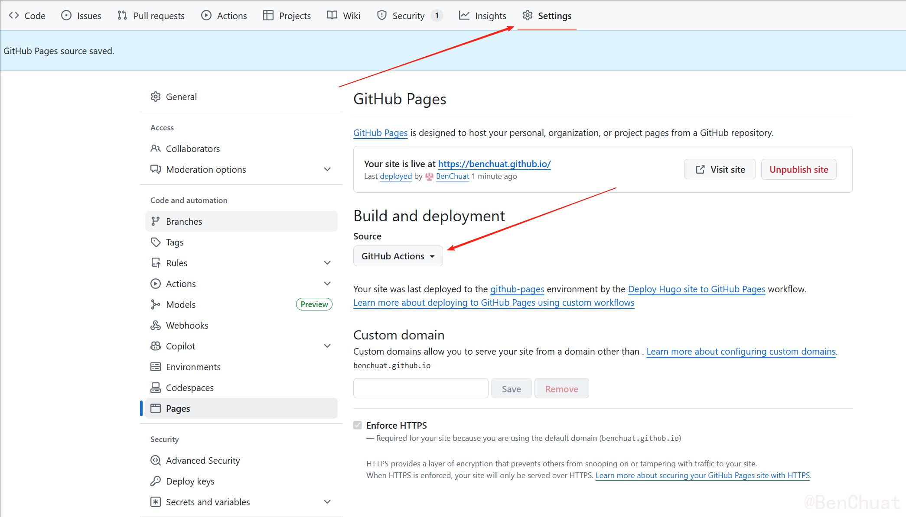

==推送到github上后记得修改baseURL！！！==

把项目根路径下的hugo.toml文件里的`baseURL =  http://localhost:1313/blog/` 改为你的github路径

`baseURL = "http://[你的GitHub用户名].github.io/"`

这时你就能用github托管的网址url访问了，我的网页 -> [BenChuat的记录本](https://benchuat.github.io/)

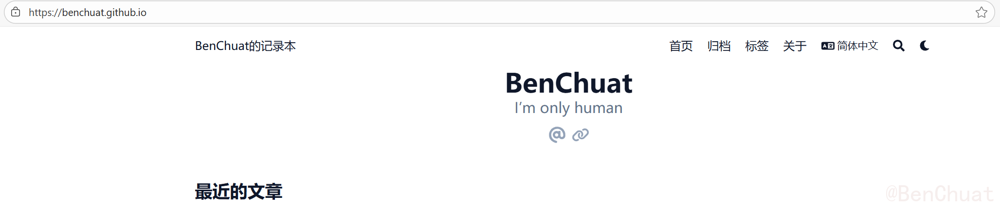

------

#### 测试自动部署

现在只需要执行：

```bash
git add .
git commit -m "update site"
git push
```

每当你推送到 main 分支时，GitHub Actions 会自动：

1. 安装 Hugo
2. 运行 `hugo --minify`
3. 生成静态文件
4. 自动发布到 GitHub Pages

大约 1～2 分钟后，访问：

```
https://benchuat.github.io/
```

你的博客就会自动更新上线啦！🎉

------

## 目录结构建议

推荐你的项目结构如下：

```
D:\hugo\blog\
│
├── archetypes/                # 新文章模板（例如默认 front matter）
│   └── default.md
│
├── assets/                    # 资源文件（SCSS、JS、图片等）
│
├── content/                   # 内容目录（你的博客文章按语言分）
│   ├── en/                    # 英文站内容
│   │   ├── posts/             # 英文文章目录
│   │   │   ├── hello-hugo.md
│   │   │   └── test-post.md
│   │   ├── about/             # 英文 About 页面
│   │   │   └── _index.md
│   │   └── _index.md          # 英文首页元数据
│   │
│   ├── zh-cn/                 # 中文站内容
│   │   ├── posts/             # 中文文章目录
│   │   │   ├── hello-hugo.md
│   │   │   └── test-post.md
│   │   ├── about/             # 中文 About 页面
│   │   │   └── _index.md
│   │   └── _index.md          # 中文首页元数据
│   │
│   └── _index.md              # 根 index（可选）
│
├── data/                      # 可选的数据文件 (YAML/JSON/TOML)
│
├── i18n/                      # 国际化翻译文件
│   ├── en.yaml
│   └── zh-cn.yaml
│
├── layouts/                   # 自定义页面模板（若覆盖主题内容）
│
├── public/                    # Hugo 生成的静态网站（自动生成，不需提交）
│   ├── index.html
│   ├── en/
│   ├── zh-cn/
│   └── ...
│
├── static/                    # 静态资源（不会被 Hugo 处理，直接复制到 public/）
│   ├── images/
│   ├── favicon.ico
│   └── ...
│
├── themes/                    # 主题目录（如 Blowfish）
│   └── blowfish/
│       ├── archetypes/
│       ├── assets/
│       ├── layouts/
│       ├── i18n/
│       ├── static/
│       ├── config.toml
│       └── theme.toml
│
├── .github/                   # GitHub Actions 自动部署配置
│   └── workflows/
│       └── deploy.yml         # 自动构建 & 部署 Hugo 到 GitHub Pages
│
├── config/                    # Hugo 多语言配置目录
│   └── _default/
│       ├── hugo.toml          # 全局配置（baseURL、多语言启用等）
│       ├── languages.en.toml  # 英文站配置
│       ├── languages.zh-cn.toml  # 中文站配置
│       ├── params.toml        # 全局参数（首页布局、显示文章数量等）
│       ├── menus.en.toml      # 英文导航菜单
│       ├── menus.zh-cn.toml   # 中文导航菜单
│       ├── module.toml        # 模块导入配置（主题）
│       └── markup.toml        # Markdown 渲染选项
│
├── resources/                 # Hugo 编译缓存（自动生成，可忽略）
│
├── .gitignore                 # Git 忽略规则
│   ├── /public/
│   ├── /resources/
│   ├── .DS_Store
│   ├── *.log
│
├── go.mod                     # Hugo 模块依赖（记录主题等模块）
├── go.sum
│
├── hugo.toml                  # 根配置文件（重定向到 config/_default）
│
└── README.md                  # 项目说明文件

```

> ⚠️ 不需要再上传 `public/` 目录！
>  它会在构建时自动生成。
>  可以在 `.gitignore` 里添加：
>
> ```
> /public/
> /resources/
> ```

------

