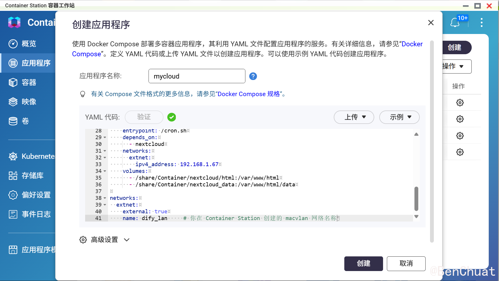
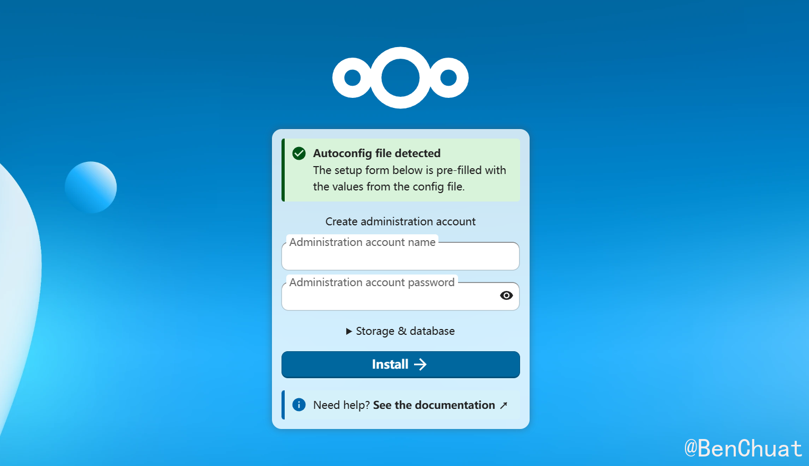
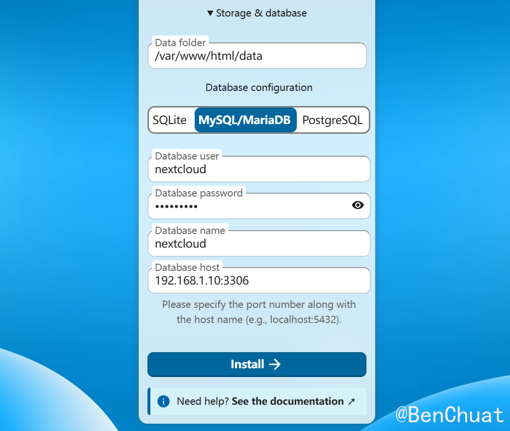

+++
title = "威联通 NAS 使用 YAML 部署 Nextcloud（复用现有 MariaDB + Redis，macvlan 独立 IP）"
date = "2025-11-11T15:19:10.383768+08:00"
lang = "zh-cn"
draft = "false"
slug = "nextcloud"
categories = []
tags = [ "NAS", "" ]
featured = "false"
summary = ""
+++
# 威联通 NAS 使用 YAML 部署 Nextcloud（复用现有 MariaDB + Redis，macvlan 独立 IP）

------

## 一、项目背景

在自建私有云盘方案中，**Nextcloud** 以开源、可扩展、跨平台而闻名，非常适合在 **威联通 NAS** 上构建个人或团队云存储。
 不过很多用户已经运行了 **MySQL/MariaDB 数据库容器**与**Redis 服务容器**，希望 Nextcloud 直接复用这些现有资源，而不是重复部署。

本文将介绍如何在 **QNAP Container Station** 中通过 **YAML 方式创建容器**，实现：

✅ Nextcloud 运行在独立 macvlan 网络（拥有独立 IP）；
 ✅ 直接连接已有的 MySQL/MariaDB 数据库；
 ✅ 使用 Redis 加速文件锁与缓存性能；
 ✅ 支持后续通过 Nginx Proxy Manager 或 HTTPS 反代访问。

------

## 二、部署思路与准备工作

### 系统环境

| 项目     | 说明                                                    |
| -------- | ------------------------------------------------------- |
| NAS 系统 | QNAP QTS 5.2.x                                          |
| 容器平台 | Container Station（Docker 后端）                        |
| 数据库   | 已部署 MariaDB 或 MySQL 容器（例如 IP：`192.168.1.10`） |
| 缓存服务 | 已部署 Redis 容器（例如 IP：`192.168.1.65`）            |
| 网络     | 已创建 macvlan 网络 `dify_lan`（或其他自定义名称）      |

### 网络结构示意

```text
┌───────────────────────────────────┐
│             局域网               │
│                                   │
│  ┌──────────────┐   ┌────────────┐│
│  │ NAS: 192.168.1.5│ │ DB:192.168.1.10││
│  │ (ContainerStation)││ Redis:192.168.1.65││
│  └──────────────┘   └────────────┘│
│        │macvlan(dify_lan)          │
│        ▼                           │
│  Nextcloud 容器 (192.168.1.70)     │
└───────────────────────────────────┘
```

------

## 三、创建目录结构

在 NAS 上创建以下文件夹，用于持久化存储：

```bash
/share/Container/nextcloud/
├── html/      # 存放 Nextcloud 程序与配置
└── data/      # 存放用户上传的文件
```

确保权限正确（可在部署后修复）：

```bash
chown -R 33:33 /share/Container/nextcloud/
```

------

## 🧩 四、YAML 配置文件

打开 **Container Station → 容器 → 从 YAML 创建**，粘贴以下内容👇

```yaml
version: "3.8"

services:
  nextcloud:
    image: docker.1ms.run/library/nextcloud
    container_name: nextcloud
    restart: unless-stopped
    networks:
      extnet:
        ipv4_address: 192.168.1.66         # 独立IP（改为你计划分配的地址）
    volumes:
      - /share/Container/nextcloud/html:/var/www/html
      - /share/Container/nextcloud_data:/var/www/html/data

    environment:
      MYSQL_HOST: "192.168.1.10:3306"      # 你的 MariaDB 容器IP
      MYSQL_DATABASE: "nextcloud"
      MYSQL_USER: "nextcloud"
      MYSQL_PASSWORD: "StrongPass!"
      PHP_MEMORY_LIMIT: "1024M"
      PHP_UPLOAD_LIMIT: "4096M"
      APACHE_BODY_LIMIT: "0"  

  nextcloud-cron:
    image: docker.1ms.run/library/nextcloud
    container_name: nextcloud-cron
    restart: unless-stopped
    entrypoint: /cron.sh
    depends_on:
      - nextcloud
    networks:
      extnet:
        ipv4_address: 192.168.1.67
    volumes:
      - /share/Container/nextcloud/html:/var/www/html
      - /share/Container/nextcloud_data:/var/www/html/data

networks:
  extnet:
    external: true
    name: dify_lan     # 你在 Container Station 创建的 macvlan 网络名称
```



------

## 🪄 五、启动容器

1️⃣ 在 YAML 编辑页面 → 点击 “创建”
 Container Station 会自动拉取镜像并启动容器。

2️⃣ 打开浏览器访问：

==默认端口为80，无需填写，若改了记得加端口==

```
http://192.168.1.x
```

如果你看到 Nextcloud 安装引导界面 ，表示部署成功！



------

## 🧱 六、数据库配置（复用已有 MariaDB）

如果你的数据库中尚未创建 Nextcloud 用户与库，请在 MariaDB 容器中执行：

```sql
CREATE DATABASE nextcloud CHARACTER SET utf8mb4 COLLATE utf8mb4_general_ci;
CREATE USER 'nextcloud'@'%' IDENTIFIED BY 'StrongPass!';
GRANT ALL PRIVILEGES ON nextcloud.* TO 'nextcloud'@'%';
FLUSH PRIVILEGES;
```

然后在 Nextcloud 安装页面填写：

| 选项       | 示例值            |
| ---------- | ----------------- |
| 数据库类型 | MySQL/MariaDB     |
| 数据库主机 | 192.168.1.10:3306 |
| 数据库名   | nextcloud         |
| 用户名     | nextcloud         |
| 密码       | StrongPass!       |

点击“安装”后系统会自动写入 `/var/www/html/config/config.php`。



------

## ⚡ 七、接入 Redis 缓存服务

Redis 能显著提升文件锁、会话与分布式缓存性能。

1️⃣ 打开 Container Station → nextcloud → 终端（Console）
 输入以下命令编辑配置文件：

```bash
vi /var/www/html/config/config.php
```

2️⃣ 在结尾的 `);` 之前加入：

```php
'filelocking.enabled' => true,
'memcache.local' => '\OC\Memcache\APCu',
'memcache.distributed' => '\OC\Memcache\Redis',
'memcache.locking' => '\OC\Memcache\Redis',

'redis' => [
  'host' => '192.168.1.x',         // Redis 容器 IP
  'port' => 6379,
  'password' => 'StrongPass!', // 若无密码可删此行
  'timeout' => 1.5,
],
```

3️⃣ 验证连接：

```bash
apt-get update && apt-get install -y redis-tools
redis-cli -h 192.168.1.65 -a 'StrongPass!' PING
```

若返回 `PONG` 即表示连接成功。

------

## 🔧 八、优化与维护建议

| 优化方向            | 配置方法                                                     |
| ------------------- | ------------------------------------------------------------ |
| **定时任务 (Cron)** | 已通过 `nextcloud-cron` 容器自动执行 `/cron.sh`，每 5 分钟触发一次 |
| **文件权限**        | `chown -R www-data:www-data /var/www/html /var/www/html/data` |
| **域名信任**        | 在 `config.php` 添加：`'trusted_domains' => ['192.168.1.70', 'cloud.example.com'],` |
| **PHP 性能**        | 提高内存与上传限制：`PHP_MEMORY_LIMIT=1024M`, `PHP_UPLOAD_LIMIT=4096M` |
| **HTTPS 支持**      | 可搭配 Nginx Proxy Manager / Caddy / httpsok 提供 SSL        |

------

## 🚀 九、常见问题排查

| 问题                | 可能原因                 | 解决方案                               |
| ------------------- | ------------------------ | -------------------------------------- |
| 无法连接数据库      | 网络不通或账号权限不足   | 检查 MariaDB 容器 IP、端口与防火墙     |
| Redis 不生效        | 配置路径错误或密码不匹配 | 检查 `config.php` 中的 `redis` 配置段  |
| 安装卡顿或白页      | PHP 内存不足或权限错误   | 调整 `PHP_MEMORY_LIMIT` 并执行 `chown` |
| 容器无法连宿主机 DB | macvlan 无法访问宿主     | 可将 DB 容器也接入同一 macvlan 网络    |
| 文件上传报错        | 数据目录权限不对         | 在容器内执行 `chmod -R 775 data/`      |

